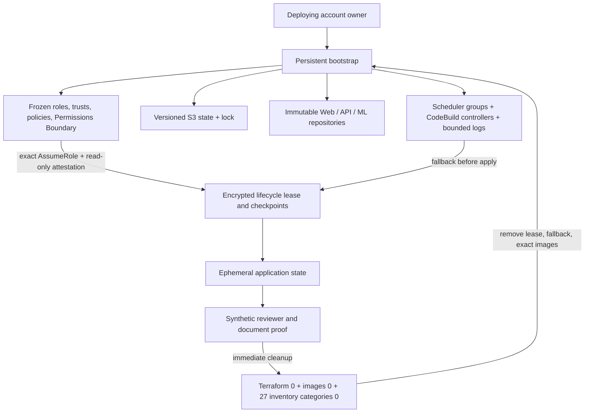
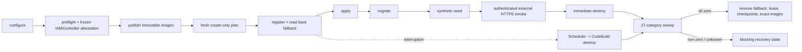

# Portable managed-ephemeral AWS operations guide

This is the canonical route through the fourth ReactorFront Portfolio delivery
slice. It explains the system first for hiring agents, recruiters, and
technical screeners, then gives an engineer the ordered public path, safety
boundaries, recovery model, and exact evidence needed to evaluate or reproduce
it in an independently owned AWS account.

> Documentation boundary: this guide is intentionally a **90% prototype**.
> It favors a useful mental model and safe navigation over an exhaustive dump
> of every IAM statement, provider argument, retry, and historical correction.
> The governing rule is **90% completeness, 100% honesty**: simplification may
> remove low-signal detail, but it must not distort authority, network paths,
> ownership, cost, lifecycle order, destroy proof, evidence, or limitations.

Issue [#129](https://github.com/Kentaro-Ono-jp/Portfolio/issues/129) published
this explanation from existing repository and public evidence. It performed no
new deployment, lifecycle command, Scheduler or CodeBuild invocation, GitHub
Actions run, Terraform operation, IAM change, or other AWS write.

## The two-minute explanation

This portfolio proves more than a Terraform apply. A public clone can preserve
the same Web, API, asynchronous worker, authentication, object-storage, review,
and audit boundaries in a short-lived managed AWS environment, prove the
authenticated document path, and remove the billable application again.

The difficult engineering work is concentrated in four places:

1. **Authority is split.** One-time account administration installs a frozen
   IAM contract. Normal deployment can attest it and use exact roles, but
   cannot create or repair IAM.
2. **Cleanup exists before creation.** A one-time destroy fallback is
   registered and read back before billable Terraform apply. Normal success
   destroys immediately; it does not wait for the fallback.
3. **Local and cloud behavior stay compatible.** MinIO, Dex, and local
   RabbitMQ remain deterministic development fixtures while S3 task roles,
   Cognito access tokens, and Amazon MQ RabbitMQ 4.2 preserve the cloud
   contracts.
4. **Absence is proved, not assumed.** Terraform state, exact image digests,
   service-specific inventory, and ownership-tag inventory must all be empty.
   A workflow conclusion, destroy exit code, Budget alert, or Scheduler
   invocation is not enough.

The accepted maintainer proofs include an owner-started manual lifecycle and a
real repository `schedule` lifecycle. Both reached authenticated asynchronous
smoke, immediate destroy, and a 27-category zero-residue sweep. The scheduled
proof is [Actions run 31489580926](https://github.com/Kentaro-Ono-jp/Portfolio/actions/runs/31489580926).
The environment is an evaluation profile, not a continuously hosted product,
SLA, or production-readiness claim.

## Architecture and ownership

```mermaid
flowchart LR
    Reader["Public clone owned by the deploying party"]
    Admin["One-time account owner / admin"]
    Frozen["Persistent frozen IAM + boundary"]
    Control["Persistent state, ECR, Scheduler, CodeBuild"]
    Gateway["Two API Gateway HTTPS APIs"]
    Link["VPC Link + Cloud Map"]
    Web["Fargate Web"]
    API["Fargate API area"]
    ML["Fargate ML worker"]
    DB["Single-AZ RDS PostgreSQL 18"]
    MQ["Single-instance Amazon MQ RabbitMQ 4.2"]
    Objects["Encrypted application S3"]
    Identity["Cognito Authorization Code + PKCE"]

    Admin -->|"install / maintain once"| Frozen
    Admin -->|"bootstrap in own account"| Control
    Reader -->|"short-lived exact role chain"| Frozen
    Frozen -->|"attest, never repair"| Control
    Control -->|"TTL-first lifecycle"| Gateway
    Gateway --> Link
    Link --> Web
    Link --> API
    Web -->|"generated API HTTPS endpoint"| API
    Identity --> Web
    API --> DB
    API --> MQ
    MQ --> ML
    API --> Objects
    ML --> Objects
```



What to notice:

- The deploying party owns the AWS account, credentials, state, resources,
  data, and every resulting charge. Nothing depends on the maintainer account
  or a maintainer-private runtime file.
- Fargate tasks have public addresses only for outbound access. Security
  Groups expose no task, database, or broker directly to the Internet. Browser
  ingress ends at API Gateway; there is no NAT Gateway, ALB, CloudFront, WAF,
  custom domain, or public signup in the initial profile.
- The API remains the only PostgreSQL application-state owner. ML receives no
  PostgreSQL credential and no end-user identity.
- Persistent controls are deliberately outside the Terraform state they may
  destroy. Application network, identity, data, runtime secrets, and tasks are
  ephemeral.

Deep design sources: [ADR-0023](ips-microkernel/adr/0023-portable-managed-ephemeral-aws-deployment.md),
[Delivery Specification 0004](ips-microkernel/delivery/0004-portable-managed-ephemeral-aws-deployment.md),
the [environment guide](infra/aws/environment/README.md), and the
[lifecycle guide](infra/aws/lifecycle/README.md).

## Three independent evaluation experiences

| Experience | Identity and infrastructure | Purpose |
|---|---|---|
| GitHub evaluation | AWS-free clean runner, repository-owned synthetic fixtures | Authoritative full build, static analysis, Compose runtime, browser E2E, and evidence inventory |
| Local Docker Compose | Dex, MinIO, PostgreSQL, RabbitMQ, Web, API roles, and ML on one isolated project | Deterministic development and human evaluation without an AWS account |
| Managed-ephemeral AWS | Cognito, task-role S3, Amazon MQ, RDS, API Gateway, Cloud Map, and Fargate | Bounded proof that the same accepted application boundaries survive managed services, destroy, and residue verification |

The mappings are adapters, not hidden production dependencies:

- MinIO fixture credentials become the standard AWS credential chain and
  short-lived ECS task-role S3 access. AWS mode rejects static application
  credentials and custom endpoints.
- Dex's local OIDC contract becomes Cognito Authorization Code with PKCE. The
  API still requires exact issuer, audience, time/signature, reviewer group,
  and `token_use=access`; an ID token is rejected.
- Local RabbitMQ becomes Amazon MQ RabbitMQ 4.2 while retaining publisher
  confirms, durable request/result queues, transactional-outbox handoff,
  late acknowledgement, idempotency, retry, redelivery, and recovery.

See [AWS runtime compatibility](AWS_RUNTIME_COMPATIBILITY.md) for the exact
application adapter contract.

## Persistent, ephemeral, and proof-only state



| State | Examples | Owner | Expected after a successful run |
|---|---|---|---|
| Persistent bootstrap | backend bucket and lock contract, three empty ECR repositories, static IAM, Scheduler groups, two controller projects per environment, bounded controller logs | Deploying account | Remains for repeat operation and may still cost money |
| Ephemeral application | VPC/subnets/routes/SGs/endpoints, API Gateway/VPC Link/Cloud Map, ECS/task definitions, RDS, MQ, Cognito, application S3, Secrets Manager, runtime logs | One `manual` or `monthly` environment state key | Absent |
| Per-run control | fallback schedule, S3 lease/checkpoints, exact image digests | Exact source SHA and environment | Absent after zero residue |
| Synthetic proof | one bounded reviewer, synthetic PDF/data, private credential capsule | Exact lifecycle run | Absent and never public evidence |

All taggable application resources carry exactly:
`PortfolioEnvironment`, `PortfolioManaged=true`,
`PortfolioPersistent=false`, and `PortfolioRepository`. The full enforcement
and accepted service-specific tagging limitations remain in
[AWS_BOOTSTRAP.md](AWS_BOOTSTRAP.md); this guide does not duplicate every IAM
statement.

## Responsibility before any AWS operation

The operator must accept all of the following:

- Use only an AWS account and GitHub repository the operator is authorized to
  administer. The repository owner supplies every account, region, repository,
  state-key, role, trust, and cost input.
- Prices, quotas, availability, and service behavior vary by region and time.
  This repository provides no price cap or cost guarantee. A Budget alert is
  observation, not an automatic stop.
- Use only repository-owned synthetic PDFs and the generated bounded reviewer.
  Never use production, client, employer, personal, or confidential data.
- Treat Terraform state, generated secrets, reviewer credentials, plans,
  provider diagnostics, raw logs, account IDs, and real variable files as
  private. Do not attach them to an Issue or PR.
- Stop on IAM drift, unexpected resources, foreign state, a lease conflict,
  an unverified source SHA, failed destroy, or non-zero residue. Do not rename
  a failure as success or start another construction attempt over it.

## Prerequisites and exact source

The checked-in contract pins Python `3.13.14`, Node `24.18.0`, Terraform
`1.15.8`, and AWS provider `6.58.0`. The operating path also requires Git,
AWS CLI v2, pnpm with the committed lockfile, and Chromium through Playwright
for authenticated smoke. Service availability and quota must support two
selected Availability Zones, Fargate, RDS PostgreSQL 18 with an accepted
`db.t4g` evaluation class, Amazon MQ RabbitMQ 4.2 on `mq.m7g.large`, Cognito,
API Gateway V2/VPC Link, Cloud Map, Scheduler, CodeBuild, S3, ECR, Secrets
Manager, and CloudWatch Logs in the chosen region.

Start from a clean public revision, not a local unpublished tree:

```console
git clone https://github.com/example-owner/example-repository.git
cd example-repository
git switch --detach 0123456789abcdef0123456789abcdef01234567
git status --short
git rev-parse HEAD
```

The example SHA and repository are non-authorizing placeholders. Replace them
with the full public commit and repository that will be bound into state,
images, controllers, trust, and evidence. A dirty tree or an unpublished SHA
fails the lifecycle.

Install pinned dependencies and prove the repository without AWS first:

```console
pnpm install --frozen-lockfile
uv sync --project apps/api --frozen
uv sync --project apps/ml --frozen
python scripts/verify.py --static-only
```

The AWS-focused subset is also available:

```console
python scripts/verify.py --groups aws-static
```

These commands are AWS-free proof. They do not authorize or imply an apply.

## One-time bootstrap and frozen IAM

Read the complete [portable bootstrap guide](AWS_BOOTSTRAP.md) before doing
this. The short route is:

1. Copy `infra/aws/bootstrap/terraform.tfvars.example` to the ignored
   `infra/aws/bootstrap/owner.auto.tfvars` and replace every synthetic value
   with resources owned by the deploying party.
2. Configure the explicit account, partition, region, prefix, repository,
   backend names/keys, owner principal, GitHub OIDC provider, protected
   environment, workflow ref, and immutable repository subject.
3. Privately review the initial local-state plan, apply it only with account
   owner authorization, then migrate that same state into its new encrypted
   S3 backend.

```console
terraform -chdir=infra/aws/bootstrap init
terraform -chdir=infra/aws/bootstrap plan -out=bootstrap.tfplan
terraform -chdir=infra/aws/bootstrap apply bootstrap.tfplan
python scripts/aws_bootstrap_backend.py --bucket example-owner-state-bucket --region us-east-1 --key bootstrap/terraform.tfstate
```

Then, from `infra/aws/bootstrap`, run the backend migration with the generated
ignored files:

```console
terraform init -migrate-state -backend-config=backend.hcl
terraform state pull
terraform plan
```

`terraform state pull` contains private state and must stay in the operator's
terminal or secure storage. Do not publish it.

Bootstrap creates the persistent backend, ECR, roles/boundaries, controller
projects/logs, and Scheduler groups. It does not create the application
environment. Repeated clones must reconfigure the exact existing backend and
adopt/import exact owned objects; they must not guess ownership or create a
parallel backend.

After installation, IAM is frozen. Normal deployment follows:

```text
exact source user or exact GitHub OIDC session
-> exact environment operator role
-> read-only canonical IAM attestation
-> lifecycle preflight
```

Normal deployment cannot calculate IAM quota, generate/split policies, create
versions, change trust/attachments/boundaries, invoke bootstrap IAM, or repair
drift. Maintenance returns to an explicitly authorized account-owner session.

### Third-party GitHub identity adaptation

The committed workflow is deliberately fail-closed to this repository. A fork
owner must replace the checked-in repository names and stable owner/repository
IDs in `scripts/aws_automation_contract.py`, use the same values in bootstrap
inputs, and re-run static verification. The fork must also:

- configure the repository OIDC subject template with ordered claim keys
  `repo`, `context`, `job_workflow_ref`, and `event_name`, using the immutable
  subject option;
- create the protected environment `aws-deployment`, limited to `main`, with
  no required reviewer or wait timer unless the fork deliberately changes and
  re-reviews that contract;
- add only the environment variable `AWS_AUTOMATION_ROLE_ARN`; no long-lived
  AWS key is stored in GitHub;
- keep `workflow_dispatch -> manual` and `schedule -> monthly`, with separate
  state keys, roles, controllers, names, tags, and one non-cancelling
  concurrency group.

The direct human `source-user` implementation validates the maintainer's exact
credential-only source-user name. It is public and inspectable, but it is not a
generic arbitrary-user interface. A third party should use its adapted
short-lived OIDC route or deliberately review an equivalent source identity
change rather than weakening the check.

## Exact lifecycle interface

The canonical CLI is `python scripts/aws_lifecycle.py`. `configure` derives
account-bound ARNs and names from the active exact caller plus explicit public
inputs and writes an ignored, credential-free configuration under `.git/`.

The owner-started GitHub workflow configures this automatically. For inspecting
the direct interface, use one explicit ignored configuration path:

```console
python scripts/aws_lifecycle.py --config .git/portfolio-aws-lifecycle/manual/config.json configure --caller-mode source-user --repository-identity example-owner/example-repository --name-prefix example-portfolio --environment manual --region us-east-1 --availability-zones us-east-1a us-east-1b --state-bucket example-owner-state-bucket --oidc-api-audience https://api.example.invalid/api
```

That source-user command succeeds only for the exact checked-in human identity
contract. The GitHub workflow instead uses `--caller-mode github-automation`
and the guarded event-to-environment mapping.

After configuration, the explicit ordered interface is:

```console
python scripts/aws_lifecycle.py --config .git/portfolio-aws-lifecycle/manual/config.json preflight
python scripts/aws_lifecycle.py --config .git/portfolio-aws-lifecycle/manual/config.json publish-images
python scripts/aws_lifecycle.py --config .git/portfolio-aws-lifecycle/manual/config.json register-fallback --ttl-minutes 60
python scripts/aws_lifecycle.py --config .git/portfolio-aws-lifecycle/manual/config.json apply
python scripts/aws_lifecycle.py --config .git/portfolio-aws-lifecycle/manual/config.json migrate
python scripts/aws_lifecycle.py --config .git/portfolio-aws-lifecycle/manual/config.json seed
python scripts/aws_lifecycle.py --config .git/portfolio-aws-lifecycle/manual/config.json smoke
python scripts/aws_lifecycle.py --config .git/portfolio-aws-lifecycle/manual/config.json status
python scripts/aws_lifecycle.py --config .git/portfolio-aws-lifecycle/manual/config.json destroy --mode manual
python scripts/aws_lifecycle.py --config .git/portfolio-aws-lifecycle/manual/config.json sweep
```

`deploy` composes preflight through authenticated smoke:

```console
python scripts/aws_lifecycle.py --config .git/portfolio-aws-lifecycle/manual/config.json deploy --ttl-minutes 60
```

It intentionally leaves the verified fallback armed. The caller must refresh
its short-lived cleanup session, destroy immediately, and sweep. The accepted
TTL range is 15–120 minutes; 60 is the normal fallback. `extend` may move an
active fallback but never beyond 120 minutes from original registration:

```console
python scripts/aws_lifecycle.py --config .git/portfolio-aws-lifecycle/manual/config.json extend --minutes 15
```

The owner-controlled workflow is the preferred complete automation surface:
it checks out the exact `main` SHA, verifies claims before OIDC, deploys,
refreshes cleanup credentials, always attempts exact manual destroy, sweeps,
and fails its summary unless deploy, destroy, and sweep all pass. The permanent
schedule is the first day of each month at 13:00 `Asia/Tokyo`. It is a
prototype requiring human post-run review, not unattended operational truth.

## TTL-first lifecycle and recovery



The S3 lease uses conditional creation and ETag compare-and-swap updates.
Manual and monthly execution therefore cannot silently share operation state.
An interruption keeps the exact source/state/controller binding available for
retry; stale or foreign state is never adopted as success.

| Situation | Required response |
|---|---|
| Preflight or IAM/controller drift | Stop before application creation. Return to separately authorized persistent maintenance; normal deployment never repairs it. |
| Partial image publication | Use the recorded/deterministic exact tags and run destroy. Cleanup validates recorded digests and removes any partial image before retry. |
| Partial or failed apply | Keep the registered fallback and lease. Resume only the exact recorded operation where supported, or use exact destroy. Do not begin a new environment over partial state. |
| Interrupted migrate, seed, or smoke | Inspect sanitized status and private diagnostics. Resume only with the matching source, lease, checkpoint, and seed owner. A different checkout cannot take over seed intent. |
| Failed smoke | Treat the environment as failed proof. Destroy and sweep; never publish source content, extracted text, tokens, or reviewer credentials to diagnose it. |
| Failed manual destroy | Leave fallback and control state intact. Diagnose the exact owned resource and retry; a failed destroy blocks the next construction. |
| Operator unavailable | The one-time Scheduler target starts the persistent destroy CodeBuild project, which assumes the exact destroy role. Invocation alone is not success; its build and sweep must complete. |
| Stale/foreign lease or control capsule | Stop. Recover only the exact owner/source/state tuple. Never delete a lock or relabel control data without proving ownership. |
| Non-zero or unknown inventory | Treat it as residue. Known stale Tagging API mappings are ignored only after the owning service independently proves absence; unknown kinds remain blocking. |
| Material implementation defect | Record it truthfully and open a new focused Issue. Do not hide Terraform, IAM, workflow, or runtime changes inside a documentation or recovery action. |

Private diagnostics are retained below `.git/portfolio-aws-lifecycle/`; they are
not public evidence.

## What zero residue means

The sweep checks 27 exact categories:

- seven EC2/network categories: VPC, subnet, Security Group, route table,
  Internet Gateway, VPC endpoint, and network interface;
- RDS database and DB subnet group;
- application S3 bucket and Amazon MQ broker;
- non-controller application log groups;
- API Gateway API and VPC Link;
- Cognito user pool;
- Cloud Map namespace and service plus its delegated private Route 53 zone;
- ECS cluster, service, task, and active task definition;
- runtime secrets;
- unresolved exact ownership-tag inventory; and
- the exact Web, API, and ML immutable image digests.

Success requires Terraform state to contain no managed environment objects,
all 27 categories to be zero, and exact per-run controls to be removed. The
persistent backend, empty ECR repositories, frozen IAM, controller projects,
Scheduler groups, and bounded retained controller logs are intentionally not
application residue.

## Human verification after every manual or scheduled run

- [ ] The event and isolated mode are correct (`workflow_dispatch/manual` or
      `schedule/monthly`), and the source is the intended public `main` SHA.
- [ ] Short-lived OIDC/source identity, operator assumption, frozen IAM
      attestation, controller readback, account, region, state key, and lease
      all passed without drift or repair.
- [ ] Three exact image digests were published and the fallback was registered
      and read back before apply.
- [ ] Apply, three ECS services/tasks, migration, synthetic seed, Cognito
      access-token login, external HTTPS upload, outbox, RabbitMQ/ML result,
      review, and audit completed.
- [ ] Destroy ran immediately after smoke or the independently recorded
      fallback completed through CodeBuild.
- [ ] Terraform state is empty, the three exact images are absent, and every
      service/tag inventory category is zero.
- [ ] Fallback schedule, lease, checkpoints, and synthetic credential capsule
      are absent; only intentional persistent resources and bounded logs remain.
- [ ] Public evidence contains only sanitized aggregate facts and stable links.
      Raw logs, state, credentials, account identifiers, document contents,
      extracted text, private costs, and provider payloads remain private.

## Security boundary

- Workloads receive short-lived task-role credentials and injected runtime
  secrets, never long-term application access keys.
- OIDC trust binds audience, immutable repository owner/repository IDs, `main`,
  protected environment, exact workflow ref, and `event_name`. Pull requests,
  forks, Dependabot, ordinary pushes/CI, and unapproved refs cannot obtain the
  deployment role.
- `iam:PassRole` is limited to exact role/service pairs. The fixed Permissions
  Boundary is an escalation ceiling; non-replaceable identity policies enforce
  generated-resource ownership. Effective permission is their intersection.
- The source credential cannot directly deploy or assume destroy/unlisted
  roles. Normal operator/deployment roles cannot mutate IAM.
- Browser ingress stops at generated API Gateway HTTPS. Tasks, RDS, and MQ
  accept no direct Internet inbound connection.
- Synthetic inputs and sanitized evidence are mandatory. Secrets Manager
  values, state content, document bytes/text, tokens, passwords, account IDs,
  and raw provider/log output are outside the public boundary.

Some AWS create/tag APIs cannot express the desired prior-resource isolation.
The accepted Cloud Map dependent `TagResource` form and API Gateway dependent
tag authorization are documented limitations. They are bounded to a dedicated
deployment account, exact ownership tags, trusted operator, empty unrelated
Cloud Map inventory, and mandatory postflight. See
[AWS_BOOTSTRAP.md](AWS_BOOTSTRAP.md) for the precise policy rationale.

## Cost, quota, and retention boundary

The deploying account is responsible for all charges, including failure
residue and persistent controls. Major drivers are:

| Cost surface | Boundary |
|---|---|
| Fargate | Three services plus a bounded migration task; Web `256/512 MiB`, API area `512/1024 MiB`, ML `1024/2048 MiB`; charged while tasks run |
| RDS | PostgreSQL 18, Single-AZ `db.t4g.micro` or `db.t4g.small`, 20 GiB gp3, no retained automated backups in the ephemeral proof |
| Amazon MQ | RabbitMQ 4.2 single-instance `mq.m7g.large`; often the largest short-window service prerequisite |
| API Gateway/VPC Link/Cloud Map | Two HTTP APIs, one VPC Link, private discovery namespace/services, request and log use |
| S3/ECR | State versions and locks, application objects, image storage/scanning, requests, and retained empty repositories; untagged ECR images expire after seven days and tagged history is capped at twenty |
| CodeBuild/Scheduler/CloudWatch | Image builds, fallback destroy builds/retries, invocations, and controller/runtime log ingestion/retention |
| Cognito/Secrets Manager | Bounded synthetic identity operations and short-lived generated runtime secret storage |

Application logs default to three days and accept only 1, 3, 5, 7, or 14
days. Synthetic objects default to two days and must expire within 1–7 days.
Controller logs retain seven days. Backend noncurrent state versions retain 90
days. These are cleanup aids, not substitutes for immediate destroy.

Before apply, confirm service availability and quota in the chosen region,
including Fargate vCPU, VPC/network resources, RDS engine/class/storage,
RabbitMQ engine/instance type, VPC Link, Cognito, ECR, CodeBuild, Scheduler, and
IAM policy/trust sizes. Static proof reserves at least 512 characters below the
6,144-character managed-policy boundary quota and below the 10,240-character
aggregate role inline-policy quota, and holds trust documents to the portable
2,048-character default. Normal deployment only attests these frozen results.

The historical maintainer Budget warning/value was an owner observation
boundary, not a portable default, price promise, or spending stop. One delayed
Cost Explorer estimate supported the real proof but did not prove cleanup.

## Accepted limitations

- This is a short-lived evaluation profile, not always-on hosting, public SaaS,
  an SLA, high availability, or disaster recovery.
- RDS is Single-AZ and Amazon MQ is single-instance. Web sessions are
  process-local and the initial services run one task each.
- Fargate public subnet addresses support outbound access; private-subnet NAT
  or broad VPC endpoint design is not part of this cost-bounded profile.
- The public endpoint is generated by API Gateway. There is no stable branded
  domain, ALB, CloudFront, WAF, or public signup.
- Proof uses one bounded reviewer and repository-owned synthetic, one-page,
  text-bearing PDFs. It does not use real customer documents or PII.
- The ML worker is CPU-only and sized for the tiny reviewed model. The
  synthetic evaluation is not production accuracy, calibration, fairness,
  privacy, robustness, or generalization evidence.
- Automation requires human post-run review. Scheduler delay, workflow
  success, destroy exit status, Budget email, or delayed billing estimate does
  not independently prove zero residue.
- The current direct human lifecycle binds an exact maintainer source-user
  identity; a third-party fork must adapt and re-prove its own immutable GitHub
  identity contract or deliberately review an equivalent source identity.
- Service prices, quotas, provider behavior, available instance types, and
  retention cost change over time. This guide records the accepted contract,
  not a guarantee that a future AWS account can run without adaptation.

## Evidence ledger

### Reviewed delivery increments

The table distinguishes workflow proof, carried evidence, qualified absence,
and accepted residuals. `Changes requested` is never rewritten as Approval.

| Increment | Exact reviewed publication | Exact-head proof and inventory | Review / Gate B | Merge and merged-main proof |
|---|---|---|---|---|
| Planning, [#96](https://github.com/Kentaro-Ono-jp/Portfolio/issues/96) | [PR #97](https://github.com/Kentaro-Ono-jp/Portfolio/pull/97), `ca786f8e41707f789338b9813d210e62e4df8937` | [run 31264072176](https://github.com/Kentaro-Ono-jp/Portfolio/actions/runs/31264072176): docs `1/9`, eight groups carried, skip none, tests `0/53` | Gate B and triggered Stage B passed; [Approved](https://github.com/Kentaro-Ono-jp/Portfolio/pull/97#issuecomment-5226812164) | `79fe440bc0a0e8a1f534c40da4f2ccc1fc7ade15`; [main run 31265246751](https://github.com/Kentaro-Ono-jp/Portfolio/actions/runs/31265246751), `0/9` executed, `9/9` carried, `0/53`, skip none |
| Runtime compatibility, [#103](https://github.com/Kentaro-Ono-jp/Portfolio/issues/103) | [PR #104](https://github.com/Kentaro-Ono-jp/Portfolio/pull/104), `6dad5b5d054efb81f92146ad19b2ac4e1cdc0e4b` | [run 31292045641](https://github.com/Kentaro-Ono-jp/Portfolio/actions/runs/31292045641): `9/9`, `55/55`, carry/skip none; RabbitMQ rerun `5/9`, `37/55` | Gate B and triggered Stage B passed; [Approved](https://github.com/Kentaro-Ono-jp/Portfolio/pull/104#issuecomment-5229688748) | `73714b664801f4d1f2d287943db4402194166175`; [main run 31294015274](https://github.com/Kentaro-Ono-jp/Portfolio/actions/runs/31294015274), `0/9`, all carried, `0/55` |
| Portable bootstrap, [#106](https://github.com/Kentaro-Ono-jp/Portfolio/issues/106) | [PR #107](https://github.com/Kentaro-Ono-jp/Portfolio/pull/107), `fb471e76b7c1c7f5d44a74eee5049351d6ddbf6c` | [run 31305934176](https://github.com/Kentaro-Ono-jp/Portfolio/actions/runs/31305934176): `10/10`, `56/56`, skip none | Gate B passed; final verdict remained [Changes requested](https://github.com/Kentaro-Ono-jp/Portfolio/pull/107#issuecomment-5230879042); the [owner accepted the named MQ create residual](https://github.com/Kentaro-Ono-jp/Portfolio/issues/106#issuecomment-5230891377) | `19bb7711ddd6a2181c7a9966ad1ff3060f29adf2`; [main run 31306999717](https://github.com/Kentaro-Ono-jp/Portfolio/actions/runs/31306999717), all `10/10` and `56/56` carried |
| Managed environment, [#110](https://github.com/Kentaro-Ono-jp/Portfolio/issues/110) | [PR #111](https://github.com/Kentaro-Ono-jp/Portfolio/pull/111), `b67fd6650f3429209417ed9dfcc999c9bce94ad3` | [run 31340783933](https://github.com/Kentaro-Ono-jp/Portfolio/actions/runs/31340783933): `10/10`, `57/57` through the accepted carry chain | Gate B/Stage B passed; [Approved](https://github.com/Kentaro-Ono-jp/Portfolio/pull/111#issuecomment-5234394938) | `57592e3524b05e45a5c9b2c146cae82379370acd`; [main run 31342110490](https://github.com/Kentaro-Ono-jp/Portfolio/actions/runs/31342110490) passed |
| Frozen static IAM, [#112](https://github.com/Kentaro-Ono-jp/Portfolio/issues/112) | [PR #113](https://github.com/Kentaro-Ono-jp/Portfolio/pull/113), `1b6056c5bc3352439966af23927f55c20ca7f9df` | [run 31350534711](https://github.com/Kentaro-Ono-jp/Portfolio/actions/runs/31350534711): `10/10`, `57/57`, skip none | Two initial findings corrected; Gate B/Stage B passed; [Approved re-review](https://github.com/Kentaro-Ono-jp/Portfolio/pull/113#issuecomment-5235406841) | `d3c27c4c38917f71b727423f910d685f341566cd`; [main run 31351619572](https://github.com/Kentaro-Ono-jp/Portfolio/actions/runs/31351619572) passed |
| Lifecycle and real proof, [#114](https://github.com/Kentaro-Ono-jp/Portfolio/issues/114) | [PR #115](https://github.com/Kentaro-Ono-jp/Portfolio/pull/115), `e8098f77dd01e30691ac916899409e5f07ea816f` | [run 31455570238](https://github.com/Kentaro-Ono-jp/Portfolio/actions/runs/31455570238): `2/10` and `3/59` executed, `8/10` and `56/59` carried, skip none | Gate B/Stage B passed; final [Changes requested](https://github.com/Kentaro-Ono-jp/Portfolio/pull/115#issuecomment-5248820146); the [owner accepted the named Cloud Map postflight residual and selected converge](https://github.com/Kentaro-Ono-jp/Portfolio/issues/114#issuecomment-5248839679) | `fd9cd0a9ed00312367c50eb76b844030265d9961`; [main run 31457394620](https://github.com/Kentaro-Ono-jp/Portfolio/actions/runs/31457394620) passed |
| OIDC automation, [#116](https://github.com/Kentaro-Ono-jp/Portfolio/issues/116) | Final reconciliation [PR #128](https://github.com/Kentaro-Ono-jp/Portfolio/pull/128), `b8051e970f33a0a2920f41cfb55b27e8cce1b1d1` | preceding reviewed head [run 31493697199](https://github.com/Kentaro-Ono-jp/Portfolio/actions/runs/31493697199): `10/10`, `60/60`, carry/skip none; final Markdown head had zero runs under the qualified exception | Two evidence findings corrected; Gate B/Stage B passed on the exact Markdown diff; [Approved re-review](https://github.com/Kentaro-Ono-jp/Portfolio/pull/128#issuecomment-5254134969) | `a4ff417a00ec087391da785f9ee0918aaf08fef0`; identical reviewed/merge tree; `[skip ci]`, zero merge-head runs: qualified limitation, not a pass |

### Issue 116 live-first PR chain

Issue #116 explicitly selected one live-first correction chain. PR #117 had
normal exact-head verification; PRs #118–#127 intentionally used `[skip ci]`
and no separate intermediate review while each correction was exercised by the
bounded live path. Final CI and independent review evaluated the accumulated
state in PR #128. The absent intermediate runs are limitations, not passes.

| PR | Purpose | Exact head | Squash merge | Evidence classification |
|---|---|---|---|---|
| [#117](https://github.com/Kentaro-Ono-jp/Portfolio/pull/117) | Initial isolated OIDC automation | `368dcecd00df8a586dd7c06519a8c6c8fc6ce097` | `a3c9222164afd652c6e11c67bc13d478838f7c80` | [run 31469248318](https://github.com/Kentaro-Ono-jp/Portfolio/actions/runs/31469248318) passed; live-first chain then began |
| [#118](https://github.com/Kentaro-Ono-jp/Portfolio/pull/118) | Converge live automation | `54f9bea38d41dacaacb1758870aed7541e165d2d` | `29b5cd2b39e2a4a68ed7f525d48ee94eed4bb883` | qualified intermediate no-run; evaluated by later live/final evidence |
| [#119](https://github.com/Kentaro-Ono-jp/Portfolio/pull/119) | Pin controller region | `994e32c4cecd5b2dbcf604930e21d766150af9ae` | `1213b603f7c265021a05480de2cd3a7454206489` | qualified intermediate no-run; wrong-region residue separately cleaned/read back |
| [#120](https://github.com/Kentaro-Ono-jp/Portfolio/pull/120) | Verify OIDC claims before assume | `7a60054261cf2f0bf2bd557411fe159c59b35a95` | `c8650dfeddb92cf0f9e9e5a70c19c1ba6f9cc123` | qualified intermediate no-run; fail-before-AWS guard |
| [#121](https://github.com/Kentaro-Ono-jp/Portfolio/pull/121) | Bind immutable repository identity | `8829834eea5143aed71bf11835e43c18d2e4417a` | `2f5921910e4ed21c22bc0eb8a268b1f0e7deb155` | qualified intermediate no-run; immutable OIDC proof followed |
| [#122](https://github.com/Kentaro-Ono-jp/Portfolio/pull/122) | Share exact Git remote contract | `14921f18cf08dc1e873a72f9a9285947e1afa5ce` | `124897e6f86ed247a6fb2c77dce746e8087903df` | qualified intermediate no-run; later live path exposed next boundary |
| [#123](https://github.com/Kentaro-Ono-jp/Portfolio/pull/123) | Bind IAM attestation to immutable subject | `e01c553a4b0e7f08d9305180268a224c2853f3d5` | `2ce978bd7b6b92687d6bef7bbb967c5d7e89cfdd` | qualified intermediate no-run; static IAM then passed live |
| [#124](https://github.com/Kentaro-Ono-jp/Portfolio/pull/124) | Resolve Terraform runtime paths once | `d698d09c60bf080bb5d498e294c1fa13fda27e0f` | `61bb3c33aebca0166b9f602af1a4e4df8ea0a679` | qualified intermediate no-run; cleanup proved zero |
| [#125](https://github.com/Kentaro-Ono-jp/Portfolio/pull/125) | Install complete smoke toolchain before OIDC | `f591ddee670058790077b2c3d1e1d2bf052976d7` | `3ff9d9a7ac0864cdd24bb4bc78218eca95729c7d` | qualified intermediate no-run; accepted manual proof followed |
| [#126](https://github.com/Kentaro-Ono-jp/Portfolio/pull/126) | Temporarily enable a real schedule proof | `b3cff389709334e1a0c2c40c57d34471fdab61ed` | `3a6ec9e318c6c3d1ad5f68696b1210bab20debae` | explicit `[skip ci]`; exact head of accepted scheduled lifecycle |
| [#127](https://github.com/Kentaro-Ono-jp/Portfolio/pull/127) | Remove temporary schedule | `9f4fd484b66c6705d0644551f818da1f61881127` | `bb827f7c91cfaa6e9e63cf02d4a1ffa2f4387e36` | explicit `[skip ci]`; zero intermediate runs; permanent schedule-only readback |
| [#128](https://github.com/Kentaro-Ono-jp/Portfolio/pull/128) | Final evidence reconciliation | `b8051e970f33a0a2920f41cfb55b27e8cce1b1d1` | `a4ff417a00ec087391da785f9ee0918aaf08fef0` | preceding full CI plus exact-head/merge-head Markdown-only qualified limitations; independently Approved |

### Real AWS evidence and current state

| Evidence | What it proves | Classification |
|---|---|---|
| Historical Step 4 `3/3` exploratory attempts | Provider-dependent authorization findings, partial destroy, state returned to zero, service/tag inventory zero | Truthful failed construction history; not a green lifecycle and no longer a numeric cap |
| Issue [#114](https://github.com/Kentaro-Ono-jp/Portfolio/issues/114) live cycle | 24 static IAM documents with zero drift, three images, fallback before apply, 85-resource topology, ECS `3/3`, migration/seed/authenticated smoke/review/audit, destroy, 27 zero categories | Accepted maintainer human-source green proof |
| [Manual run 31482504475](https://github.com/Kentaro-Ono-jp/Portfolio/actions/runs/31482504475) | Exact GitHub `workflow_dispatch/manual` OIDC lifecycle through immediate destroy and zero residue | Accepted automation proof |
| [Schedule run 31489580926](https://github.com/Kentaro-Ono-jp/Portfolio/actions/runs/31489580926) | Exact repository `schedule/monthly` lifecycle at `3a6ec9e...`, after a 35m29s scheduler delay, completing in 28m37s with 60-minute fallback and zero residue | Accepted real scheduled proof; delay did not consume TTL before registration |
| Issue #129 bounded Console readback, 2026-08-12 | us-east-1 ECS/RDS/MQ/API Gateway and one-time schedules absent; persistent state bucket, three ECR repositories, manual/monthly Scheduler groups, CodeBuild controllers, and static role families present | Sanitized current-state support only; not historical workflow/destroy proof. CloudWatch Logs UI failed to load and was excluded. |

Implementation history also keeps seven failed Scheduler-to-CodeBuild destroy
diagnostics before the first successful automatic destroy. They exposed the
Terraform archive filename/checksum, CodeBuild Python 3.13 path, and exact
lease-read authority. They remain failures; only the later complete automatic
destroy and independent zero sweep are passing evidence.

### Step 8 publication record

Focused [Issue #129](https://github.com/Kentaro-Ono-jp/Portfolio/issues/129)
and [PR #130](https://github.com/Kentaro-Ono-jp/Portfolio/pull/130) own this
README/guide publication and Delivery Specification completion. The exact
reviewed head, Markdown-only no-run limitation, Gate B/Stage B result,
independent verdict, squash merge, merge-head no-run limitation, and closure
reconciliation remain in those live GitHub ledgers. A tracked commit cannot
name its own eventual exact reviewed or squash-merge SHA without moving that
SHA; the stable Issue and PR links avoid a false self-reference.

Issue #129 intentionally uses no new GitHub Actions or AWS execution. Its
review and merge are qualified by the repository's Markdown-only exception;
absence is recorded as a limitation and never replaces the existing runtime
and scheduled-lifecycle proof above.

## Where to go next

- Persistent account setup and IAM rationale:
  [AWS_BOOTSTRAP.md](AWS_BOOTSTRAP.md)
- Managed application topology and ownership:
  [infra/aws/environment/README.md](infra/aws/environment/README.md)
- Lifecycle implementation, retry, controller, and live history:
  [infra/aws/lifecycle/README.md](infra/aws/lifecycle/README.md)
- Application adapter behavior:
  [AWS_RUNTIME_COMPATIBILITY.md](AWS_RUNTIME_COMPATIBILITY.md)
- Durable completion contract and exact limitations:
  [Delivery Specification 0004](ips-microkernel/delivery/0004-portable-managed-ephemeral-aws-deployment.md)
- Public live ledger:
  [umbrella Issue #95](https://github.com/Kentaro-Ono-jp/Portfolio/issues/95)

If another polishing pass would only add low-signal implementation detail,
follow the selected prototype boundary: stop at the useful 90%, preserve the
canonical deep links, and keep every claim honest.
