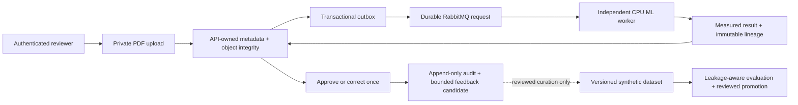
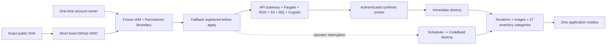

# ReactorFront Portfolio

> **Four vertical slices completed — 2026-08-12.** The portfolio now proves
> the product locally, in clean-runner GitHub evaluation, and through a bounded
> managed AWS lifecycle that destroys its application and verifies zero
> residue.

[](https://github.com/Kentaro-Ono-jp/Portfolio/actions/workflows/verify.yml?query=branch%3Amain+event%3Apush)
[](https://app.codecov.io/github/Kentaro-Ono-jp/Portfolio)
[](LICENSE)

ReactorFront Portfolio is one reproducible **Document Intelligence and Human
Review Platform**, not a profile site or a collection of unrelated demos. It
shows product reasoning, TypeScript/React, Python APIs, asynchronous processing,
applied ML, identity and authorization, immutable review/audit evidence,
infrastructure, failure recovery, and evidence-governed delivery in one public
system.

For the deepest cloud story, open the
**[portable managed-ephemeral AWS operations guide](AWS_OPERATIONS_GUIDE.md)**.
It explains the architecture with Mermaid, gives the third-party route, and
records the exact proof and limitations. The root README stays portfolio-wide.

> Evaluation uses only public, permissively licensed, or repository-owned
> synthetic inputs. Client, employer, personal, and production documents are
> outside the project boundary.

## The product problem

Document automation is not just classification. A trustworthy system must
preserve the source, process work asynchronously, expose the machine result,
let an authenticated reviewer make one final decision, and retain who decided
what without silently turning corrections into training data.



The API remains the owner of PostgreSQL state and the transactional outbox.
The ML worker receives neither PostgreSQL credentials nor end-user identity.
The browser sees an opaque Web session; the API independently validates bearer
capability and ownership. Machine prediction, measured corpus evidence, human
decision, and later training eligibility remain separate records.

## What is proved

| Engineering area | Public evidence |
|---|---|
| Product and application | Next.js/React Web, FastAPI, OpenAPI-generated types, PostgreSQL migrations, private objects, polling/recovery UX, accessibility, and browser E2E |
| Asynchronous reliability | Transactional outbox, publisher confirms, durable request/result queues, retry, redelivery, idempotent receipts, late acknowledgement, and independent worker recovery |
| Identity and security | OIDC Authorization Code + PKCE, server-owned sessions, CSRF, API token validation, owner filtering, capabilities, private sources, task roles, secret injection, and fail-closed trust |
| Human review and audit | Immutable machine evidence, optimistic concurrency, idempotent one-time decisions, append-only audit events, and sanitized feedback candidates |
| Applied ML | Versioned synthetic data, family-disjoint splits, reproducible CPU PyTorch evaluation, reviewed promotion/rollback, and runtime lineage |
| Managed AWS | Terraform, Fargate, RDS, S3, Amazon MQ, Cognito, API Gateway/VPC Link/Cloud Map, frozen IAM, OIDC automation, TTL-first destroy, and 27-category zero-residue proof |
| Delivery discipline | Focused Issues/PRs, ADRs, delivery specifications, exact-head evidence, independent review, qualified limitations, and post-merge reconciliation |

The strongest fourth-slice evidence is the accepted real repository
[`schedule/monthly` run 31489580926](https://github.com/Kentaro-Ono-jp/Portfolio/actions/runs/31489580926):
short-lived GitHub OIDC, verified 60-minute safety fallback, managed apply,
migration, synthetic seed, authenticated asynchronous smoke, immediate
destroy, and all 27 residue categories at zero. It is historical proof of an
ephemeral evaluation window, not an always-on availability claim.

## Three ways to evaluate the repository

| Route | AWS required? | Best for |
|---|---:|---|
| GitHub Actions | No | Clean-runner authoritative verification of static, Compose runtime, RabbitMQ 4.2, and browser paths |
| Local Docker Compose | No | Running the complete deterministic product with Dex, MinIO, PostgreSQL, RabbitMQ, Web, API roles, and ML |
| Managed-ephemeral AWS | Yes, in the deploying party's account | Inspecting or reproducing the short-lived managed-service lifecycle, identity/authority boundaries, destroy, and residue proof |

Merge alone never deploys AWS. Ordinary PRs, forks, Dependabot, and normal
`main` verification receive no AWS credential or write authority. The managed
path is separately authorized, uses the deploying party's account/state/cost,
and is documented in the [AWS operations guide](AWS_OPERATIONS_GUIDE.md).

## Run locally

Install the pinned dependencies and run AWS-free static verification:

```console
pnpm install --frozen-lockfile
uv sync --project apps/api --frozen
uv sync --project apps/ml --frozen
python scripts/verify.py --static-only
```

GitHub Actions runs the full root verifier without the flag. A human who
deliberately owns local Docker execution may run the same complete route:

```console
python scripts/verify.py
```

The root [`compose.yaml`](compose.yaml) owns only the isolated
`reactorfront-portfolio` project. The Web is available on
`http://127.0.0.1:53000` and the API on `http://127.0.0.1:58000`. Sign in as the
repository-owned synthetic reviewer and upload a synthetic PDF of at most
5 MiB. Host ports are loopback-only and configurable through
[`.env.example`](.env.example); the MinIO console is not published.

For a deliberate component-by-component startup and RabbitMQ data-volume
upgrade procedure, read [CONTRIBUTING.md](CONTRIBUTING.md). AI-assisted work
does not start or mutate Docker Desktop and enters through
[`GIT_AGENTS.md`](GIT_AGENTS.md).

## The completed managed AWS slice

The fourth vertical slice keeps the product boundaries while mapping local
fixtures to managed services:



The profile is NAT-free and inbound-closed: public Fargate addresses are used
only for outbound access, while browser ingress ends at generated API Gateway
HTTPS. RDS and Amazon MQ are isolated. Normal deployment can attest the exact
static IAM contract but cannot create, mutate, or repair IAM.

Persistent backend, empty ECR repositories, frozen roles/boundaries,
Scheduler groups, CodeBuild controllers, and bounded controller logs remain
for repeat operation. The VPC, gateways, discovery, tasks, database, broker,
application bucket, Cognito pool, runtime secrets/logs, per-run schedule,
images, state objects, and synthetic credentials are destroyed and swept.

Read the progressive layers:

1. **[AWS operations guide](AWS_OPERATIONS_GUIDE.md)** — value, diagrams,
   responsibility, ordered operation, recovery, cost/security/limits, and exact
   evidence.
2. [AWS bootstrap and authority](AWS_BOOTSTRAP.md) — persistent state/ECR/IAM,
   trust, boundary, PassRole, quotas, and accepted AWS authorization limits.
3. [Managed environment](infra/aws/environment/README.md) and
   [TTL-first lifecycle](infra/aws/lifecycle/README.md) — component-level
   Terraform and controller behavior.
4. [AWS runtime compatibility](AWS_RUNTIME_COMPATIBILITY.md) — MinIO/S3,
   Dex/Cognito, RabbitMQ/Amazon MQ, and measured Fargate sizing.

## Four completed vertical slices

| Slice | Outcome | Durable route |
|---|---|---|
| 1. Asynchronous document path | Private upload, object-integrity proof, outbox, independent ML, durable result, Web status/recovery, and full browser path | [Delivery 0001](ips-microkernel/delivery/0001-first-vertical-slice.md), [Issue #1](https://github.com/Kentaro-Ono-jp/Portfolio/issues/1) |
| 2. Authenticated human review | Real OIDC + PKCE, owner/capability enforcement, immutable approve/correct decision, source preview, concurrency/idempotency, and audit | [Delivery 0002](ips-microkernel/delivery/0002-second-vertical-slice.md), [Issue #27](https://github.com/Kentaro-Ono-jp/Portfolio/issues/27) |
| 3. Governed model evaluation | Sanitized feedback export, reviewed curation, family-disjoint snapshot, champion/candidate comparison, promotion/rollback, and runtime lineage | [Delivery 0003](ips-microkernel/delivery/0003-third-vertical-slice.md), [Issue #72](https://github.com/Kentaro-Ono-jp/Portfolio/issues/72) |
| 4. Portable managed AWS lifecycle | Managed adapters/topology, least privilege and frozen IAM, TTL-first lifecycle, human and GitHub OIDC proofs, destroy, zero residue, and third-party guide | [Delivery 0004](ips-microkernel/delivery/0004-portable-managed-ephemeral-aws-deployment.md), [Issue #95](https://github.com/Kentaro-Ono-jp/Portfolio/issues/95) |

The active `document-type-candidate-v1` model is reconstructed from the fixed
12-sample training split in the 18-sample
`reactorfront-synthetic-documents-v1` snapshot. On four held-out synthetic
samples it processes `4/4` with macro F1 `1.0` and per-class recall `1.0`.
These tiny synthetic measurements are reproducibility evidence, not calibrated
probability, production accuracy, fairness, privacy, robustness, or
generalization claims. See the [model-development summary](apps/ml/MODEL_DEVELOPMENT.md)
and [model card](apps/ml/MODEL_CARD.md).

## Architecture, contracts, and repository map

- [Architecture documentation](ips-microkernel/architecture/index.md)
- [ADR index](ips-microkernel/adr/index.md), including
  [ADR-0021](ips-microkernel/adr/0021-govern-human-feedback-model-evaluation-and-promotion.md)
  and [ADR-0023](ips-microkernel/adr/0023-portable-managed-ephemeral-aws-deployment.md)
- [Delivery index](ips-microkernel/delivery/index.md)
- [OpenAPI 3.1 contract](packages/contracts/openapi/openapi.yaml) and
  [generated TypeScript](packages/contracts/generated/api.d.ts)

```text
Portfolio/
|-- apps/
|   |-- web/                 # Next.js/React browser and server session boundary
|   |-- api/                 # FastAPI, PostgreSQL, outbox, review, and audit owner
|   `-- ml/                  # Independent inference and evaluation worker
|-- packages/contracts/      # Language-neutral HTTP and event contracts
|-- infra/
|   |-- docker/              # Deterministic local fixtures
|   `-- aws/                 # Persistent bootstrap, ephemeral environment, lifecycle
|-- tests/                   # Cross-service integration and browser E2E
|-- scripts/                 # One root verifier and bounded operational entrypoints
|-- ips-microkernel/         # ADRs, delivery specs, review/CI/governance routing
`-- .github/workflows/       # AWS-free verification and isolated AWS lifecycle
```

## Security and honest limitations

The committed Dex issuer is a loopback synthetic fixture, not a production
identity provider. The repository accepts no production accounts or documents.
Web sessions are process-local; PDFs are one text-bearing page; the classifier
has two synthetic classes; the AWS proof uses Single-AZ/single-instance
evaluation sizing, one task per service, generated HTTPS, outbound-only public
task addresses, and CPU-only ML. There is no SLA, public signup, multi-tenancy,
HA, disaster recovery, stable domain, WAF, or always-on service.

The AWS automation is a prototype and requires human post-run verification.
Cost depends on region, time, service availability, usage, image size, retained
controls, and failure residue; the deploying account owns it. Workflow success,
Terraform exit status, a Scheduler invocation, Budget alert, or delayed cost
estimate does not replace zero-residue inventory.

Report vulnerabilities through [SECURITY.md](SECURITY.md), never through a
public Issue. Read [CONTRIBUTING.md](CONTRIBUTING.md) before proposing changes,
and submit only repository-owned synthetic fixtures.

## License

Copyright (c) 2026 Kentaro Ono (ReactorFront).

Original source code, documentation, and synthetic fixtures are licensed under
the [MIT License](LICENSE) unless a file states otherwise. Third-party
dependencies, assets, datasets, models, and runtime infrastructure remain
subject to their own terms in [THIRD_PARTY_NOTICES.md](THIRD_PARTY_NOTICES.md).
