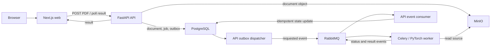

# Delivery Specification 0001: First end-to-end vertical slice

- Status: Completed
- Date: 2026-07-18
- Accepted: 2026-07-18
- Started: 2026-07-18
- Completed: 2026-07-20
- Owner: ReactorFront
- Tracking issue: [#1](https://github.com/Kentaro-Ono-jp/Portfolio/issues/1)
- Related decisions:
  - [ADR-0001: Adopt a modular monorepo](../adr/0001-modular-monorepo.md)
  - [ADR-0002: Target an AI-enabled document intelligence platform](../adr/0002-target-document-intelligence-platform.md)
  - [ADR-0003: Adopt the initial technology stack](../adr/0003-initial-technology-stack.md)
  - [ADR-0004: Keep state ownership in the API and use a transactional outbox](../adr/0004-api-state-ownership-and-transactional-outbox.md)

## Purpose

Deliver the smallest real product flow that crosses the web, API, storage,
queue, ML, database, and browser-result boundaries. Prove that the repository
can be checked out into a clean GitHub-hosted runner and verified without
maintainer-specific state.

This specification is an implementation contract, not a disposable AI prompt.
Its lifecycle is `Proposed` -> `Accepted` -> `In Progress` -> `Completed`.
When the slice is complete, retain this file, change its status to `Completed`,
and add links to the implementation, workflow run, and final evidence. Do not
delete the plan-to-result history that a reviewer can use as engineering proof.

## Outcome

A user uploads a synthetic, single-page text PDF in the browser. The API stores
the source document and atomically records a processing job plus an outbox
event. An API-owned dispatcher publishes the event. A Python/PyTorch worker
extracts text, classifies the document as an `invoice` or `report`, and
publishes status and result events. An API-owned consumer persists those events.
The web application polls the API and displays the terminal result.

## Scope boundaries

### Included

- one synthetic, single-page PDF fixture containing extractable text
- browser upload, progress display, and terminal classification result
- PDF signature, MIME type, and size validation
- object storage for the uploaded PDF
- durable document and job records
- transactional outbox dispatch
- asynchronous RabbitMQ delivery and Celery execution
- a small deterministic PyTorch document-type classifier
- explicit queued, processing, completed, and failed states
- health and readiness checks
- API, integration, and browser-level verification
- clean GitHub Actions build, start, test, evidence, and teardown

### Excluded from this slice

- authentication and authorization
- persistent public hosting
- image uploads, scanned-PDF OCR, and multi-page processing
- human correction or approval
- bulk upload and concurrent-job performance work
- semantic search, `pgvector`, RAG, and generative AI
- AWS/Terraform deployment
- Kubernetes, Helm, and EKS
- production model quality claims

The slice will not be deployed as an unauthenticated public service. Public
access in this phase means public source code and public CI evidence.

## Functional contract

### Document constraints

- Content type: `application/pdf`
- File signature: starts with `%PDF-`
- Maximum size: 5 MiB
- Supported content: one page with extractable text
- Test data: generated or authored specifically for this repository
- Stored object name: server-generated; never trust the submitted filename
- Integrity: persist a SHA-256 digest for the stored source

### Processing states

| State | Meaning | Allowed next state |
|---|---|---|
| `accepted` | Source, job, and outbox event are committed | `queued`, `failed` |
| `queued` | Processing request is broker-confirmed | `processing`, `failed` |
| `processing` | A worker owns the current attempt | `completed`, `failed` |
| `completed` | A validated result is persisted | terminal |
| `failed` | A sanitized failure code is persisted | terminal in this slice |

Workers may retry transient failures up to three attempts. Broker delivery is
at least once. A repeated event must not create a second document or a
conflicting terminal result.

### Minimum persistence model

`documents`:

- `id`: UUID
- `original_filename`: submitted display name
- `object_key`: server-generated storage key
- `sha256`: source digest
- `content_type`: validated media type
- `size_bytes`: validated source size
- `created_at`: UTC timestamp

`processing_jobs`:

- `id`: UUID
- `document_id`: document reference
- `status`: controlled state value
- `attempt_count`: integer
- `model_version`: nullable until processing starts
- `predicted_class`: nullable `invoice` or `report`
- `confidence`: nullable number from 0 through 1
- `failure_code`: nullable sanitized code
- `created_at`, `started_at`, `completed_at`: UTC timestamps

`outbox_events`:

- `event_id`: UUID and idempotency identity
- `event_type`: versioned event name
- `aggregate_id`: processing-job reference
- `payload`: validated event payload
- `created_at`: UTC timestamp
- `published_at`: nullable UTC timestamp
- lease and attempt fields required for recoverable dispatch

Database constraints must prevent impossible status/result combinations where
practical. Raw exception text must not be exposed through the public API.

### Minimum synchronous API

`POST /api/v1/documents`

- accepts a multipart PDF
- returns HTTP `202 Accepted`
- returns `documentId`, `jobId`, and `status: accepted`
- returns a stable problem response for invalid media type, signature, or size

`GET /api/v1/documents/{documentId}`

- returns document identity and current processing state
- returns class, confidence, and model version only when completed
- returns a sanitized failure code when failed
- returns HTTP `404` for an unknown identifier

`GET /health`

- proves that the process is running
- does not claim that dependencies are ready

`GET /ready`

- proves that required runtime dependencies are reachable
- returns non-success while the service cannot accept useful work

The generated OpenAPI 3.1 document is the canonical synchronous contract. The
web application must use generated TypeScript types or a generated client.

### Minimum asynchronous event

Required event names:

- `document.processing.requested.v1`
- `document.processing.started.v1`
- `document.processing.completed.v1`
- `document.processing.failed.v1`

Required fields:

- `eventId`
- `occurredAt`
- `correlationId`
- `documentId`
- `jobId`
- `objectKey`
- `sourceSha256`

Terminal result events additionally carry the model version and either the
validated classification result or a sanitized failure code.

The JSON Schema is versioned under `packages/contracts`. Consumers reject an
invalid event without silently treating it as a valid job.

### Minimum ML proof

- Extract text from the supported PDF fixture.
- Apply deterministic normalization and feature construction.
- Execute a PyTorch model that returns `invoice` or `report` plus confidence.
- Generate the small model artifact reproducibly from repository-owned
  synthetic training inputs with a fixed seed.
- Build the artifact into the ML image without committing generated model
  binaries to normal Git history.
- Emit model name, version, input contract, training-data description, metric,
  limitation, and intended-use information in a model card.
- Classify the canonical sample invoice as `invoice` with confidence at or
  above `0.70` in the canonical CI run.

Model accuracy on synthetic data is not presented as production-grade quality.
The proof in this slice is a real, reproducible ML lifecycle and inference
boundary. Later slices will add meaningful evaluation datasets and quality
claims.

## Pre-implementation gates

Application coding starts only after these repository gates pass:

- initialize local Git with default branch `main`
- confirm the configured author name and email without publishing secrets
- create `Kentaro-Ono-jp/Portfolio` as a public GitHub repository without
  generating a second README, license, or `.gitignore`
- commit and push the documentation scaffold as the public baseline
- confirm `origin` points to the intended repository
- create a focused implementation issue and branch for this slice
- keep the first application implementation out of the baseline commit

This order preserves visible planning and review history instead of publishing
the whole system as one retrospective bulk commit.

## Step 1: Implement the smallest end-to-end product flow

### Deliverables

- Next.js upload and result page in `apps/web`
- FastAPI endpoints, persistence, migrations, outbox dispatcher, and event
  consumer in `apps/api`
- Celery/PyTorch processing worker in `apps/ml`
- OpenAPI and event schemas in `packages/contracts`
- synthetic training inputs and PDF fixtures under test-owned paths
- unit tests in each deployable area

### Acceptance criteria

- A browser user can select the canonical sample PDF and submit it once.
- The UI displays `accepted` or `queued`, then `processing`, then `completed`
  without reload.
- The completed view displays `invoice`, confidence, and model version.
- The uploaded source exists in object storage and its digest matches the
  database record.
- The job result survives API and worker restarts because the API-owned
  PostgreSQL schema is the authoritative state store.
- Invalid content receives a clear, stable response and creates no job or
  outbox event.
- A committed outbox event is eventually published after dispatcher restart.
- Worker exceptions publish `failed` with a sanitized code rather than leaving
  a permanently processing job.
- The ML worker has no API database credentials.
- Duplicate delivery or result events do not create a duplicate terminal
  result.

## Step 2: Make the repository safe and understandable when public

### Deliverables

- public-facing README with purpose, architecture, quick start, and limitations
- accepted ADRs and this delivery specification linked from the README
- `.env.example` containing safe non-secret development values
- root MIT License with `Kentaro Ono (ReactorFront)` as the copyright holder
- security and contribution guidance appropriate to a public repository
- public-only synthetic fixtures with provenance documented

### Acceptance criteria

- A repository search finds no credentials, private URLs, personal paths,
  private client names, copied client material, or confidential identifiers.
- A new reader can identify the product, supported flow, prerequisites, one
  verification command, and known limitations from the README.
- No required file is excluded from Git because it happened to exist locally.
- No checked-in file or example requires a GitHub secret for this slice.
- The license decision is explicit; public visibility is not mistaken for an
  open-source license.

## Step 3: Start verification from a clean GitHub-hosted runner

### Deliverables

- `.github/workflows/verify.yml`
- one repository-owned verification entrypoint, initially `scripts/verify.py`
- workflow triggers for pull requests, the default branch, and manual dispatch

### Required runner assumptions

- GitHub-hosted Ubuntu runner
- repository available only through `actions/checkout`
- no maintainer `.env`, Docker image, volume, model cache, or database state
- no GitHub Secrets for the first slice
- read-only default workflow permissions except where GitHub requires more
- no external application service after dependency and image acquisition

### Acceptance criteria

- The workflow invokes the same repository-owned verification entrypoint that
  a reviewer can run.
- A cold run succeeds without a manually primed cache.
- Removing local untracked files does not change the runner result.
- All configuration required for the test environment is created from tracked
  files or explicit safe workflow values.
- The workflow does not depend on the maintainer's local Docker Desktop.

## Step 4: Build every application image from source

### Compose services for the slice

- `web`
- `api`
- `api-outbox`
- `api-events`
- `ml-worker`
- `postgres`
- `rabbitmq`
- `minio`
- one-shot migration and object-store initialization tasks if required

### Build requirements

- multi-stage Dockerfiles where they materially reduce runtime contents
- committed dependency lock files
- explicit versioned base images; no floating `latest` tags
- non-root runtime users for application containers
- useful OCI image labels
- no secret copied into an image layer
- deterministic ML artifact generation inside the controlled build path
- only `web` and `api` exposed to the host when verification requires them
- no `container_name`; Compose owns names under `reactorfront-portfolio`

### Acceptance criteria

- `docker compose -p reactorfront-portfolio build --pull` succeeds on the clean
  runner.
- Every runtime image starts without downloading an unpinned model artifact.
- The ML image contains the expected model metadata and checksum.
- Runtime images do not contain development-only credentials or local paths.
- Build failure identifies the failing service and preserves useful output.

## Step 5: Start the complete Compose environment and wait for readiness

### Startup requirements

- Compose project name remains `reactorfront-portfolio`.
- PostgreSQL, RabbitMQ, and MinIO have real health checks.
- API readiness depends on required database, broker, and object-store access.
- The outbox dispatcher proves database and publisher-confirm connectivity.
- The API event consumer proves broker and database connectivity.
- Web readiness depends on the application being able to serve its test route.
- Schema migration completes before the API accepts the test workflow.
- Object-store bucket initialization is idempotent.
- The worker proves broker connectivity before the system is declared ready.
- Host ports are configurable and only assigned where the verifier needs them.

### Acceptance criteria

- The startup command returns success only when all required services are
  healthy or required one-shot tasks have completed successfully.
- Startup reaches readiness within 120 seconds on the cold GitHub runner.
- A failed migration or dependency health check fails the workflow before the
  browser test starts.
- `docker compose -p reactorfront-portfolio ps` identifies every expected
  service and no unrelated service.
- Re-running initialization does not corrupt or duplicate required state.

## Step 6: Verify the business flow automatically

### Verification sequence

1. Confirm API and web readiness.
2. Run API contract and integration checks.
3. Open the web application with Playwright.
4. Upload the canonical synthetic invoice PDF.
5. Observe accepted or queued and processing state, allowing fast transitions
   to be confirmed through the API or event evidence when the UI cannot sample
   them.
6. Wait no more than 60 seconds for a terminal state.
7. Assert `invoice`, confidence at least `0.70`, and the expected model version.
8. Confirm the source digest and persisted terminal state through a controlled
   verification endpoint or test query.
9. Upload a non-PDF fixture and assert the documented validation failure.

### Acceptance criteria

- Unit, contract, integration, and browser-level tests all pass.
- At least one test executes real PyTorch inference; mocks alone cannot satisfy
  the canonical ML check.
- The successful browser flow uses public HTTP/API boundaries rather than
  importing private implementation from another deployable area.
- The ML worker never reads or writes the API-owned PostgreSQL schema.
- Killing the outbox dispatcher after commit and then restarting it still
  results in one terminal job result.
- Correlation identifiers allow the upload, job, worker log, and result to be
  connected.
- No verification step requires a human click, retry, database edit, or sleep
  chosen by guesswork.
- The complete cold workflow targets a maximum duration of 15 minutes.

## Step 7: Preserve failure evidence and tear down the ephemeral environment

### Evidence captured on failure

- Compose service state
- timestamped logs for all slice services
- health and readiness results
- migration and initialization output
- Playwright trace, screenshot, and test report
- test reports and coverage summaries
- sanitized configuration summary without secret values

### Teardown rules

- Teardown runs under an unconditional workflow step.
- On a GitHub-hosted ephemeral runner only, remove the
  `reactorfront-portfolio` containers, networks, and project-owned volumes.
- Never translate the CI volume-removal command into an automatic local cleanup
  command.
- Never run Docker prune or any unscoped bulk cleanup.
- Failure to upload one evidence artifact must not skip teardown.

### Acceptance criteria

- A deliberately failing verification run produces enough evidence to locate
  the failing service and test stage.
- Artifacts contain no credentials or submitted private data.
- Teardown targets only the Compose project created by the workflow.
- The final CI runner state contains no running `reactorfront-portfolio`
  container.
- Both test success and test failure paths execute teardown.

## Step 8: Publish visible, reproducible proof

### Deliverables

- GitHub Actions status badge near the top of the README
- documented one-command verification path
- link from README to the workflow and this specification
- architecture/data-flow diagram
- OpenAPI artifact or browsable API description
- model card and limitations
- CI job summary containing build, test, and service-verification outcomes

### Acceptance criteria

- The badge reflects the default-branch canonical workflow, not an unrelated
  lint-only workflow.
- A reviewer can reach the latest run and its logs from the repository.
- The README distinguishes public source/CI proof from persistent public
  hosting.
- The documented command and the command used by GitHub Actions share the same
  underlying verification entrypoint.
- One manual cold-cache dispatch and one default-branch run pass without
  maintainer intervention.

## Definition of done for the complete slice

This delivery specification can move to `Completed` only when all of the
following are true:

- Steps 1 through 8 meet every acceptance criterion or document an explicitly
  approved exception.
- The public repository contains focused, reviewable history rather than one
  unexplained bulk implementation commit.
- The canonical workflow is green from a clean GitHub-hosted runner.
- The workflow uses no secret and no maintainer-specific state.
- The real PDF-to-PyTorch-to-browser flow passes.
- The outbox recovery and duplicate-event paths pass.
- The failure path has been exercised and its evidence inspected.
- The README, architecture documentation, contracts, and actual behavior agree.
- This file records completion date, implementation PRs, final workflow run,
  known limitations, and follow-up slices.

## Completion evidence

- Implementation was delivered through focused PRs
  [#2](https://github.com/Kentaro-Ono-jp/Portfolio/pull/2),
  [#4](https://github.com/Kentaro-Ono-jp/Portfolio/pull/4),
  [#6](https://github.com/Kentaro-Ono-jp/Portfolio/pull/6),
  [#8](https://github.com/Kentaro-Ono-jp/Portfolio/pull/8),
  [#10](https://github.com/Kentaro-Ono-jp/Portfolio/pull/10),
  [#12](https://github.com/Kentaro-Ono-jp/Portfolio/pull/12),
  [#14](https://github.com/Kentaro-Ono-jp/Portfolio/pull/14),
  [#16](https://github.com/Kentaro-Ono-jp/Portfolio/pull/16),
  [#17](https://github.com/Kentaro-Ono-jp/Portfolio/pull/17),
  [#19](https://github.com/Kentaro-Ono-jp/Portfolio/pull/19),
  [#21](https://github.com/Kentaro-Ono-jp/Portfolio/pull/21),
  [#23](https://github.com/Kentaro-Ono-jp/Portfolio/pull/23), and
  [#25](https://github.com/Kentaro-Ono-jp/Portfolio/pull/25).
- PR #25 head
  [`53a46b868c49d023fa6a37dc5df6d214c0786141`](https://github.com/Kentaro-Ono-jp/Portfolio/commit/53a46b868c49d023fa6a37dc5df6d214c0786141)
  received an independent
  [approval](https://github.com/Kentaro-Ono-jp/Portfolio/pull/25#issuecomment-5021086629)
  after the complete diff, accepted design, Issues, and exact-head evidence were
  re-reviewed.
- The exact PR head passed the complete clean-runner
  [run 29731595926](https://github.com/Kentaro-Ono-jp/Portfolio/actions/runs/29731595926):
  9/9 verification groups, 36/36 test files, all eight services ready,
  Playwright browser upload through real PyTorch classification and persisted
  terminal display, stable completed and failed correlations, failure
  artifacts, and project-scoped teardown.
- Squash merge
  [`efbcedaee5d530ebd8a1c01f24f39fc58e503ac3`](https://github.com/Kentaro-Ono-jp/Portfolio/commit/efbcedaee5d530ebd8a1c01f24f39fc58e503ac3)
  passed its exact-SHA default-branch
  [run 29734332826](https://github.com/Kentaro-Ono-jp/Portfolio/actions/runs/29734332826),
  correctly carrying all nine successful groups from the tree-identical PR head
  with no skipped evidence.
- A manual full dispatch on the completed implementation tree passed
  [run 29734521272](https://github.com/Kentaro-Ono-jp/Portfolio/actions/runs/29734521272),
  re-executing all nine groups without a secret, maintainer-specific local
  state, local Docker state, or manual intervention.
- The six existing `main`-scoped pnpm and uv caches were then deleted by exact
  ID and an empty `refs/heads/main` cache listing was confirmed. The resulting
  cold-cache
  [run 29735196072](https://github.com/Kentaro-Ono-jp/Portfolio/actions/runs/29735196072)
  re-executed all nine groups at the same exact merge SHA and passed without
  maintainer intervention.
- Failed PR runs exercised and preserved diagnostic evidence for a missing
  baseline, competing queue consumer, and ambiguous accessible locators. Their
  fixes are protected by the event planner, isolated runtime verifier, strict
  Playwright locators, regression tests, and the CI playbook. Both successful
  and failed runtime paths completed project-scoped teardown.
- Known limitations remain the accepted exclusions: no authentication,
  persistent public hosting, scanned-PDF OCR, multi-page processing, human
  review, semantic retrieval, cloud deployment, or production model-quality
  claim. The classifier and fixtures are deliberately synthetic.
- Follow-up capabilities require new accepted delivery specifications and, when
  architecture changes materially, new ADRs. They are not silently implied by
  completion of this slice.

## Change control

This specification was accepted before implementation. During implementation,
any material scope, contract, service, security, or verification change must be
reflected here or in a new ADR before the slice is declared complete.

Small implementation details may change without an ADR when the observable
contract and acceptance criteria remain unchanged.
