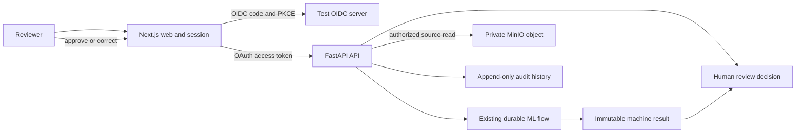

# Delivery Specification 0002: Authenticated classification review and immutable audit trail

- Status: Accepted
- Date: 2026-07-20
- Accepted: 2026-07-20
- Owner: ReactorFront
- Tracking issue: [#27](https://github.com/Kentaro-Ono-jp/Portfolio/issues/27)
- Related decisions:
  - [ADR-0001: Adopt a modular monorepo](../adr/0001-modular-monorepo.md)
  - [ADR-0002: Target an AI-enabled document intelligence platform](../adr/0002-target-document-intelligence-platform.md)
  - [ADR-0003: Adopt the initial technology stack](../adr/0003-initial-technology-stack.md)
  - [ADR-0004: Keep state ownership in the API and use a transactional outbox](../adr/0004-api-state-ownership-and-transactional-outbox.md)
  - [ADR-0007: Define the authentication, session, and API authorization boundary](../adr/0007-authentication-session-and-api-authorization.md)

## Purpose

Extend the completed classification flow with the smallest real authenticated
human-review path. Prove that a synthetic reviewer can sign in, submit and
process a supported PDF through the existing ML boundary, inspect the private
source and immutable machine result, approve or correct the classification
once, and retrieve a traceable audit history.

This specification is an implementation contract, not a disposable AI prompt.
Its lifecycle is `Proposed` -> `Accepted` -> `In Progress` -> `Completed`.
When the slice is complete, retain this file, change its status to `Completed`,
and add links to the implementation, workflow run, and final evidence. Do not
delete the plan-to-result history that a reviewer can use as engineering proof.

## Outcome

A browser user authenticates through OIDC Authorization Code flow with PKCE.
The Next.js server owns the browser session and sends an OAuth access token only
to the FastAPI resource server. The API independently authenticates the caller,
resolves an API-owned principal, and authorizes the target document. The
existing outbox, RabbitMQ, ML worker, result consumer, PostgreSQL, and object
storage path produces and retains the machine result. The reviewer views the
private PDF through an authorized application path and submits one approval or
correction. The API atomically records the immutable human decision,
idempotency receipt, and audit event without altering the machine evidence.

## Scope boundaries

### Included

- one pinned OIDC-compatible test authorization server or equivalent
  protocol-faithful test boundary
- one repository-owned synthetic reviewer identity and capability set
- Authorization Code flow with PKCE, state, nonce, callback validation, and a
  bounded server-owned browser session
- protected `HttpOnly` session cookies and CSRF protection for authenticated
  mutations
- independent API validation of OAuth access tokens
- API-owned principals derived from the stable OIDC issuer and subject pair
- deny-by-default capability and document-ownership authorization
- authenticated document submission and result access
- authorized PDF streaming through the API and same-origin Web boundary
- one terminal approval or correction for a completed machine result
- required entity-tag preconditions and idempotency keys for review writes
- append-only audit events for submission, terminal processing, and review
- a browser-visible distinction between machine evidence and human decision
- populated first-slice schema migration without fabricated human attribution
- API, integration, security-negative, concurrency, recovery, and browser proof
- clean GitHub Actions build, start, test, evidence, and teardown

### Excluded from this slice

- production identity-provider selection or provider-specific account design
- public signup, invitations, password storage, recovery, multifactor
  enrollment, passkeys, or user administration
- organizations, multi-tenant workspaces, reviewer assignment, queues,
  delegation, escalation, or administrative roles
- more than one terminal review decision, reopening, comments, or bulk review
- field-level extraction or correction
- image uploads, scanned-PDF OCR, encrypted PDFs, and multi-page processing
- semantic search, `pgvector`, RAG, prompts, and generative AI
- classifier retraining, calibration, or production model-quality claims
- direct browser access to object storage or presigned source URLs
- persistent public hosting, production TLS, AWS, Terraform, Kubernetes, Helm,
  or EKS
- full OpenTelemetry, Prometheus, or Grafana deployment
- sender-constrained tokens or new service-to-service identity

The slice will not be deployed as an authenticated public service. Public
access in this phase means public source code and public CI evidence. The test
authorization server proves the protocol boundary but is not a selected
production identity provider.

## Functional contract

### Authentication and Web session

- The Web application initiates OIDC Authorization Code flow with PKCE.
- Issuer, client identifier, API audience, redirect URI, requested scopes, and
  session limits are explicit server-side configuration.
- The callback validates transaction-specific state, nonce, PKCE, issuer, and
  token response before creating a session.
- The OIDC ID token establishes the Web session. It is not accepted by the API
  as a substitute for an OAuth access token.
- Access and refresh tokens remain server-side. They never enter browser
  JavaScript, URLs, `localStorage`, or `sessionStorage`.
- The browser receives only a bounded `HttpOnly`, `SameSite` session cookie.
  It is `Secure` outside a documented loopback-only HTTP development exception.
- The session has absolute and inactivity lifetimes. Expiry requires renewal or
  reauthentication and cannot silently become anonymous authorization.
- Sign-out invalidates the local session. Provider logout is not represented as
  guaranteed global token revocation.
- State-changing same-origin Web requests require CSRF protection bound to the
  session before an API mutation is attempted.
- The browser calls same-origin Web routes. The Web server attaches the access
  token only when calling the private API boundary.

Tokens, authorization codes, session identifiers, raw provider responses, and
complete claims must not appear in browser-visible errors, application logs,
broker messages, persisted domain state, or verification artifacts.

### API authentication and authorization

Every `/api/v1/documents` operation requires authentication after this slice.
`GET /health` and `GET /ready` remain unauthenticated for orchestration and
expose only their existing sanitized process and dependency state.

The API validates every access token independently of the Web session:

- signature against an explicitly allowed asymmetric algorithm
- exact trusted issuer and intended API audience
- expiration and not-before constraints with bounded clock skew
- required capability for the requested operation

Trusted keys come from configured issuer metadata and JWKS, use a bounded
cache, and support legitimate key rotation. An unavailable issuer or unknown
key never changes validation to allow.

The initial API-owned capabilities are:

| Capability | Authorized operation |
|---|---|
| `documents:submit` | Submit one supported PDF |
| `documents:read` | Read an owned document result or private source |
| `reviews:write` | Submit the terminal review decision for an owned document |
| `audit:read` | Read the sanitized audit history for an owned document |

Provider scopes or roles may be normalized into these capabilities, but the
mapping and authorization policy remain owned and tested by the API. A
document identifier, browser route, forwarded actor header, request-body user,
email, username, or display name never proves authority.

Missing or invalid authentication returns a canonical `401` problem with a
sanitized bearer challenge. A valid token without the required capability
returns a canonical `403` problem. Both preserve the existing request
correlation identifier without exposing validation internals.

### Principal and resource ownership

The API maps `(issuer, subject)` to one stable API-owned principal UUID. Email,
display name, and username are mutable profile attributes and are not
authorization or audit keys. A request never supplies its authoritative actor
identifier.

The initial resource policy is ownership based. A new document stores the
resolved submitting principal. An OIDC principal can read, review, or audit
only a document owned by that same API principal; a capability does not bypass
the ownership check. An unknown identifier and a document invisible to the
caller produce the same public not-found response.

Existing first-slice documents are migrated to an explicit controlled
legacy-system principal or an equally explicit constrained legacy
representation. The migration does not invent a human identity. Legacy rows do
not silently become visible to a synthetic human reviewer. Claiming,
delegation, and administrative override remain outside this slice.

### Protected document and source operations

The existing business endpoints retain their successful representation and
processing behavior while becoming protected:

`POST /api/v1/documents`

- requires `documents:submit`
- derives the submitting principal from the validated token
- atomically records the document, job, outbox event, ownership, and submission
  audit event after the existing compensated object-storage step succeeds
- retains HTTP `202 Accepted` and the existing validation failures

`GET /api/v1/documents/{documentId}`

- requires `documents:read` and document ownership
- retains the existing state, machine result, and sanitized failure contract
- returns the same public not-found response for unknown and inaccessible IDs

The slice adds:

`GET /api/v1/documents/{documentId}/source`

- requires `documents:read` and document ownership
- returns only the persisted supported PDF as `application/pdf`
- uses a sanitized inline content disposition and filename
- sets an anti-sniffing response header, content length, and strong source
  entity tag derived from the persisted digest
- verifies object identity, size, and SHA-256 against API-owned state before
  returning any bytes
- returns a stable non-success problem without source bytes when the object is
  missing, metadata conflicts, or integrity verification fails

The endpoint never returns the object key, bucket, credentials, or a durable
direct object URL. Range requests and presigned URLs remain excluded because
the supported source is at most 5 MiB and one page.

### Human review

Only an owned document whose processing job is `completed` can be reviewed.
Accepted, queued, processing, failed, unknown, inaccessible, and already
reviewed documents cannot create a new decision.

The machine classification, confidence, model version, result-event receipt,
and processing timestamps remain unchanged. The review representation adds:

- document and job identifiers
- review status: `unreviewed`, `approved`, or `corrected`
- immutable machine classification, confidence, and model version
- final human classification when reviewed
- reviewer principal identifier when reviewed
- decision timestamp when reviewed
- review version and opaque strong entity tag

`GET /api/v1/documents/{documentId}/review`

- requires `documents:read` and document ownership
- returns the current review representation and `ETag`
- synthesizes `unreviewed` only for a completed job with no decision
- does not represent failed processing as an unreviewed successful result

`PUT /api/v1/documents/{documentId}/review`

- requires `reviews:write` and document ownership
- requires `If-Match` with the latest review entity tag
- requires `Idempotency-Key` containing a UUID
- accepts only `finalClassification: invoice | report`
- derives `approved` when human and machine classifications match
- derives `corrected` when they differ
- returns the immutable terminal representation and its entity tag

The API derives the decision type, reviewer, machine basis, version,
timestamp, and audit action from authoritative state. The client cannot choose
them. Missing `If-Match` returns `428 Precondition Required`; stale or
non-matching evidence returns `412 Precondition Failed`. A terminal decision
cannot be overwritten.

### Review idempotency and concurrency

The idempotency-key namespace is scoped to the authenticated principal and
review operation. Its receipt records the target document and a canonical
request digest.

- The same committed request with the same key returns the original successful
  representation without another decision or audit event.
- Reusing the same key for another target or payload returns a canonical `409`
  problem and preserves the first result.
- Concurrent operations lock the authoritative review state and commit at most
  one review decision.
- A different request that loses the precondition race receives `412` rather
  than replacing the winner.
- The review decision, idempotency receipt, and review audit event commit in
  one PostgreSQL transaction.
- A database or audit insert failure commits none of those records and never
  reports success.

This HTTP idempotency contract is separate from the existing RabbitMQ
redelivery and result-event receipt behavior, which remains unchanged.

### Audit history

The API owns an append-only product audit record separate from transport-event
receipts and ordinary logs. This slice records at least:

- `document.submitted`
- `processing.completed`
- `processing.failed`
- `review.approved`
- `review.corrected`

Each event contains a unique ID, controlled action, timestamp, API-owned user
or system principal reference, document and related job or review ID,
correlation ID, and a versioned sanitized details object. It contains no source
text, credentials, session values, raw exceptions, complete claims, or mutable
profile copy.

Submission and its audit event commit in the submission transaction. A
terminal processing transition and its audit event commit in the result-
consumer transaction. A review decision and its audit event commit in the
review transaction. Duplicate result-event delivery or HTTP replay does not
create duplicate audit entries. The migration does not fabricate historical
events for work completed before this contract existed.

`GET /api/v1/documents/{documentId}/audit-events`

- requires `audit:read` and document ownership
- returns safe events in deterministic chronological order
- does not expose broker receipts or internal log lines as product audit events
- returns the same public not-found response for unknown and inaccessible IDs

Pagination, cross-document search, retention, export, and legal hold remain
outside this bounded event set.

### Minimum persistence model

`principals`:

- API-owned UUID and principal kind: `oidc` or `system`
- unique issuer and subject pair for an OIDC principal
- controlled identity value for a system principal
- creation timestamp and constraints enforcing the correct identity shape

`documents`:

- submitting-principal reference for newly authenticated documents
- explicit legacy representation for existing first-slice rows
- existing object identity, size, digest, media type, and timestamps unchanged

`review_decisions`:

- UUID, document and job references, and one-decision-per-job constraint
- reviewer-principal reference
- copied immutable machine classification that identifies the reviewed basis
- final human classification and derived `approved` or `corrected` status
- review version and decision timestamp
- constraints preventing an approved mismatch or corrected equality

`idempotency_records`:

- principal, operation, idempotency key, target, and request digest
- committed result reference and timestamp
- uniqueness on principal, operation, and key

`audit_events`:

- UUID, controlled action, actor, correlation, aggregate references, timestamp,
  and versioned safe details
- stable causation identity or uniqueness that suppresses duplicate system and
  review audit events

Migrations are forward and backward explicit. A real PostgreSQL integration
test upgrades a populated first-slice schema without deleting documents,
processing jobs, outbox rows, or result-event receipts.

### Required failure behavior

- Callback validation failure creates no Web session and exposes no raw
  provider response.
- An unavailable issuer prevents new sign-in and never makes protected routes
  anonymous.
- A valid token may use a still-valid bounded trusted-key cache; an unknown or
  untrusted key fails closed.
- Expired sessions or tokens create no partial business mutation.
- Invalid authentication and authorization fail before the protected use case.
- Source absence, metadata conflict, or digest mismatch returns no PDF bytes.
- Review before completion or after a terminal decision creates no decision.
- Conflicting idempotency-key reuse and stale preconditions preserve the first
  committed result.
- Failed audit persistence rolls back its associated business transition.
- Lost HTTP responses, HTTP retries, and duplicate broker delivery converge
  without duplicate terminal decisions or audit events.
- Failure evidence remains correlated and sanitized without tokens, session
  cookies, private keys, source text, or private profile claims.

## Pre-implementation gates

Application coding starts only after these repository gates pass:

- ADR-0007 and this delivery specification are explicitly accepted
- create an umbrella tracking issue for the complete second slice
- create a focused implementation issue and branch for the first increment
- fetch `origin`, verify a clean workspace, and start the branch from the exact
  current `origin/main`
- select and pin the protocol-faithful test authorization server or equivalent
  boundary after license review
- prove that identity verification needs no external account, GitHub Secret,
  committed private signing key, or maintainer-specific state
- select and pin the Web session and API token-validation libraries
- document production and loopback-development cookie behavior before coding
- accept the populated-v1 migration and controlled legacy-principal strategy
- update the verifier's service inventory, change-to-group mapping, evidence,
  and teardown ownership for the identity dependency

This design does not authorize local Docker Desktop. GitHub Actions remains the
canonical identity and browser runtime proof unless the owner explicitly
authorizes local Docker for a later exact task.

## Step 1: Implement the smallest authenticated human-review product flow

### Deliverables

- pinned OIDC-compatible test identity boundary and synthetic reviewer
- Next.js sign-in, callback, session, CSRF, renewal, and sign-out paths
- FastAPI token validation, capability policy, and principal resolution
- populated schema migration for principals, ownership, reviews, idempotency,
  and audit events
- protected submission, status, source, review, and audit endpoints
- Web source preview, review controls, final decision, and audit display
- OpenAPI, generated TypeScript, runtime validation, and unit tests

### Acceptance criteria

- A real browser sign-in uses Authorization Code flow, PKCE, state, and nonce.
- Tokens remain unreadable from browser JavaScript, storage, URLs, and pages.
- The API independently rejects missing, invalid, wrong-issuer,
  wrong-audience, expired, not-yet-valid, and insufficient-capability tokens.
- A synthetic reviewer repeatedly resolves to one stable API principal.
- The reviewer can submit a supported PDF and observe the existing real ML
  terminal result under authenticated ownership.
- The reviewer can view the matching private source without object-store
  identity, credentials, or a direct URL.
- Approval preserves the matching machine class; correction records a
  different supported final class while preserving all machine evidence.
- Exactly one terminal decision and one review audit event are committed.
- Submission, terminal processing, and review audit events are ordered,
  durable, sanitized, and duplicate safe.
- API and application restarts preserve the principal, machine result, human
  decision, and audit history.

## Step 2: Make the authenticated boundary safe and understandable when public

### Deliverables

- README status, architecture, verification, and limitation updates
- accepted ADR-0007 and this specification linked from public documentation
- trust-boundary and authenticated-review flow documentation
- safe identity and session configuration examples
- security guidance for tokens, cookies, CSRF, source access, and audit data
- repository-owned synthetic identity and correction fixtures with provenance

### Acceptance criteria

- A repository search finds no token, session secret, private key, production
  credential, private identity, private source, or confidential identifier.
- A reviewer can identify the browser, Web session, API resource server,
  identity dependency, broker, ML, database, and object-store boundaries.
- Documentation distinguishes the test authorization server from a selected
  production identity provider.
- Documentation does not imply public hosting, production account operations,
  calibrated confidence, or production model quality.
- Safe example values cannot authorize access to a real external system.
- No GitHub Secret or maintainer identity is required for the second slice.

## Step 3: Start authenticated verification from a clean GitHub-hosted runner

### Deliverables

- root verifier planning for every changed identity and review path
- workflow configuration for the test authorization dependency
- deterministic synthetic principal, capability, and browser-login setup
- contract, integration, security-negative, and browser test ownership
- exact identity configuration diagnostics with secret values omitted

### Required runner assumptions

- GitHub-hosted Ubuntu runner
- repository available only through `actions/checkout`
- no maintainer session, identity account, `.env`, signing key, token cache,
  Docker image, volume, model cache, or database state
- no GitHub Secrets for the slice
- read-only default workflow permissions except where GitHub requires more
- no external application or identity service after dependency acquisition

### Acceptance criteria

- The workflow invokes the same root verifier used for the first slice.
- Changed paths select every affected verification group without skipping
  security, contract, or runtime evidence.
- A cold run creates ephemeral signing material and synthetic identity state
  from pinned, tracked configuration.
- Removing local untracked files cannot affect authentication or review proof.
- Identity startup failure identifies the boundary without exposing secrets.
- The workflow never depends on local Docker Desktop or a human login.

## Step 4: Build changed application images and pin every runtime dependency

### Compose services for the slice

- `web`
- `api`
- `api-outbox`
- `api-events`
- `ml-worker`
- `postgres`
- `rabbitmq`
- `minio`
- one pinned test authorization server
- one-shot migration, identity initialization, and object-store initialization
  tasks when required

### Build and dependency requirements

- build every changed application image from repository source
- retain committed dependency lock files and explicit base-image versions
- pin the external identity test image by immutable version or digest
- generate signing material only at runtime and never copy it into an image
- retain non-root application runtime users and useful OCI labels
- keep tokens, session secrets, and provider credentials out of image layers
- expose only the Web, API, and test identity ports required by verification
- retain Compose-owned names under `reactorfront-portfolio`

### Acceptance criteria

- The existing source-built images continue to build on a clean runner.
- The identity dependency is version-pinned, license-reviewed, and isolated as
  test infrastructure rather than a fourth product area.
- No runtime image contains signing keys, tokens, session values, local paths,
  or development-only production credentials.
- The ML image and deterministic artifact remain unchanged unless an explicit
  reviewed compatibility change is necessary.
- Build failure identifies the failing service or dependency and preserves
  useful sanitized output.

## Step 5: Start the complete authenticated environment and wait for readiness

### Startup requirements

- Compose project name remains `reactorfront-portfolio`.
- The authorization server publishes usable issuer metadata and JWKS before
  authentication verification begins.
- The API validates identity configuration and distinguishes invalid
  configuration from temporary issuer unavailability.
- Web readiness proves that the configured sign-in and callback boundary can
  serve its test routes.
- Existing PostgreSQL, RabbitMQ, MinIO, API, outbox, consumer, and worker
  readiness rules remain authoritative.
- Migration upgrades a populated first-slice database before protected routes
  accept work.
- Synthetic identity and object-store initialization remain idempotent.
- Host ports are configurable and bound only where the verifier needs them.

### Acceptance criteria

- Startup succeeds only when every required service is healthy or required
  one-shot task has completed successfully.
- The complete environment reaches readiness within the accepted clean-runner
  runtime budget.
- Invalid issuer, audience, redirect, or migration configuration fails before
  the browser test begins.
- `docker compose -p reactorfront-portfolio ps` identifies every expected
  service and no unrelated service.
- Re-running initialization does not duplicate principals, state, or audit
  events.
- Existing processing and recovery readiness remains green under
  authentication.

## Step 6: Verify the authenticated business flow automatically

### Verification sequence

1. Confirm identity, API, Web, worker, consumer, dispatcher, PostgreSQL,
   RabbitMQ, and MinIO readiness.
2. Prove that anonymous browser and direct API requests cannot use protected
   document operations.
3. Sign in as the repository-owned synthetic reviewer through the real OIDC
   code and PKCE path.
4. Upload the canonical invoice PDF and observe the real PyTorch completed
   result.
5. Open the matching private PDF through the same-origin authorized path.
6. Approve the classification and confirm the machine evidence, human
   decision, actor, and ordered audit history.
7. Process a synthetic correction fixture with documented human ground truth
   that differs from the deliberately limited classifier result, then correct
   and finalize it.
8. Exercise one identical idempotent retry and one stale concurrent attempt.
9. Sign out and confirm that later source, review, and audit access is denied.
10. Inspect sanitized evidence and tear down only project-owned resources.

### Acceptance criteria

- Unit, contract, API integration, real PostgreSQL concurrency, and Playwright
  tests pass.
- At least one authenticated browser flow executes real PDF extraction and
  PyTorch inference through RabbitMQ and the API-owned consumer.
- Playwright proves sign-in, upload, source preview, approval, correction,
  audit display, and sign-out through public application boundaries.
- The correction fixture is identified as synthetic ground truth and not a
  model-quality metric.
- Machine and human results remain visibly distinct and accessible in the UI.
- Missing authentication, invalid token properties, insufficient capability,
  ownership denial, CSRF failure, stale precondition, and conflicting
  idempotency all preserve business state.
- Two concurrent different decisions produce one winner, one terminal
  decision, and one review audit event.
- Existing outbox restart, duplicate result delivery, worker failure, broker
  restart, and terminal-state evidence remains passing.
- Correlation identifiers connect safe login diagnostics, upload, processing,
  source, review, and audit evidence without carrying identity credentials.
- No verification step requires a human click, retry, database edit, or sleep
  chosen by guesswork.

## Step 7: Preserve sanitized failure evidence and tear down the environment

### Evidence captured on failure

- Compose service state and timestamped logs
- identity metadata and key-ID summary without signing material
- sanitized Web session and API token-validation reason codes
- health, readiness, migration, and initialization output
- Playwright trace, screenshot, and report after leakage scanning
- API, concurrency, idempotency, and recovery test reports
- configuration summary with token, cookie, secret, and private values omitted

### Teardown rules

- Teardown runs under an unconditional workflow step.
- On a GitHub-hosted ephemeral runner only, remove the
  `reactorfront-portfolio` containers, networks, and project-owned volumes.
- Remove only runtime signing material and identity state owned by that
  Compose project.
- Never translate the CI volume-removal command into automatic local cleanup.
- Never run Docker prune or any unscoped bulk cleanup.
- Artifact upload or leakage-scan failure must not skip teardown.

### Acceptance criteria

- Deliberately failing authentication, authorization, review, and audit checks
  identify the boundary and correlation without exposing credentials.
- Artifacts contain no token, authorization code, session cookie, signing key,
  source text, private profile claim, or submitted private data.
- Teardown targets only resources created by the canonical Compose project.
- The final runner state contains no running second-slice container.
- Both successful and failed runtime paths execute teardown.

## Step 8: Publish visible, reproducible authenticated-review proof

### Deliverables

- README status, verification, security, and limitation updates
- link from README to the accepted ADR and this specification
- updated architecture, trust-boundary, and human-review diagrams
- protected OpenAPI description and generated-client evidence
- CI summary containing identity, authorization, ML, review, audit, security-
  negative, recovery, evidence, and teardown outcomes
- completion dates, implementation PRs, workflow runs, known limitations, and
  follow-up slices recorded in this file

### Acceptance criteria

- A reviewer can understand and inspect the authenticated review boundary
  without running the repository.
- Public documentation distinguishes deterministic test authentication from
  production identity operations and persistent hosting.
- The badge and links lead to the default-branch authoritative workflow and
  exact reviewed evidence.
- The documented verification command and GitHub Actions share the same root
  verifier.
- The exact reviewed implementation head and exact merged `main` tree have
  successful authoritative proof.
- One manual cold-cache dispatch passes without a GitHub Secret, external
  account, maintainer state, local Docker state, or manual intervention.

## Definition of done for the complete slice

This delivery specification can move to `Completed` only when all of the
following are true:

- Steps 1 through 8 meet every acceptance criterion or document an explicitly
  approved exception.
- ADR-0007 and this specification are accepted and agree with the implemented
  identity, session, authorization, source, review, and audit boundaries.
- The public repository contains focused, reviewable implementation history.
- The clean-runner workflow is green without a secret, external identity
  account, maintainer-specific state, or local Docker dependency.
- A real browser proves authentication, private source access, ML processing,
  approval, correction, audit history, and sign-out.
- The API enforces authentication, capability, and document ownership rather
  than trusting only the Web application.
- Tokens and sessions remain outside browser JavaScript, persistent business
  state, broker messages, ML tasks, logs, and evidence.
- Machine evidence remains immutable and visibly distinct from the terminal
  human decision.
- Review decision, idempotency receipt, and audit event are atomic, retry safe,
  and concurrency safe.
- The populated first-slice migration preserves durable state without
  fabricating a human identity or historical audit event.
- Security-negative, failure, recovery, and teardown paths are exercised and
  their sanitized evidence inspected.
- README, architecture documentation, contracts, generated types, tests, and
  actual behavior agree.
- This file records completion date, implementation PRs, final workflow runs,
  known limitations, and follow-up slices.

## Completion evidence

Pending. Add implementation PRs, exact reviewed heads, authoritative workflow
runs, accepted exceptions, known limitations, and follow-up slices only after
the evidence exists.

## Change control

This proposed specification becomes the implementation contract only after
explicit acceptance. After acceptance, any material product, identity,
session, authorization, persistence, source-access, audit, security,
verification, or deployment-boundary change must be reflected here or in a new
ADR before the slice is declared complete.

Small implementation details may change without an ADR when the observable
contract and acceptance criteria remain unchanged.
