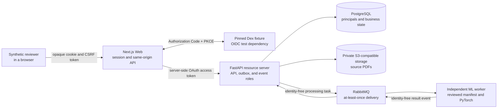
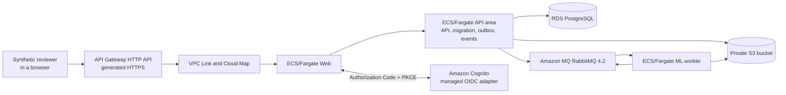
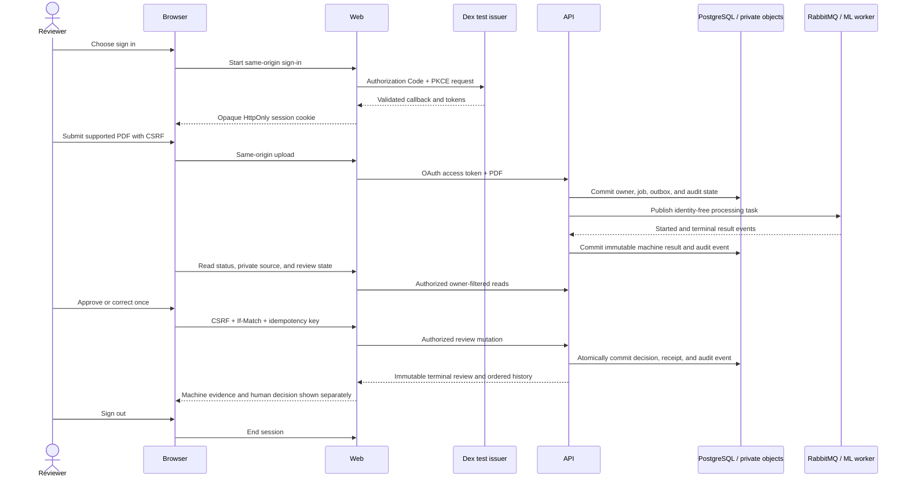

# Architecture documentation

The implemented product is a Document Intelligence and Human Review Platform.
Its three completed vertical slices authenticate one repository-owned
synthetic reviewer, process supported PDFs through an asynchronous promoted ML
boundary, protect the private source, record one immutable approval or
correction, expose append-only product audit history, and carry the exact
reviewed model lineage into the authenticated result.

A fourth vertical slice is accepted but not yet implemented. It adds a
portable managed-ephemeral AWS deployment path without replacing AWS-free
GitHub Actions or local Docker Compose and without claiming an existing hosted
service.

The governing boundaries are
[ADR-0007](../adr/0007-authentication-session-and-api-authorization.md),
[ADR-0021](../adr/0021-govern-human-feedback-model-evaluation-and-promotion.md),
[ADR-0023](../adr/0023-portable-managed-ephemeral-aws-deployment.md),
[Delivery Specification 0002](../delivery/0002-second-vertical-slice.md), and
[Delivery Specification 0003](../delivery/0003-third-vertical-slice.md), and
[Delivery Specification 0004](../delivery/0004-portable-managed-ephemeral-aws-deployment.md).
The public HTTP surface is the
[OpenAPI 3.1 contract](../../packages/contracts/openapi/openapi.yaml), with its
[generated TypeScript representation](../../packages/contracts/generated/api.d.ts).

## System context

The browser reaches only the Web origin. It never receives the private API
base URL, an object-store credential, a durable source URL, or an OAuth token.
Health and readiness probes are intentionally anonymous but expose no document
or identity detail.

This diagram is the currently implemented local and GitHub Actions runtime.
The accepted AWS adapter below preserves its ownership and trust boundaries.

## Accepted managed-ephemeral AWS deployment profile

The fourth-slice profile is an implemented Terraform definition, not live AWS
runtime evidence. It is complete only after the focused increments in
[Delivery Specification 0004](../delivery/0004-portable-managed-ephemeral-aws-deployment.md)
implement and prove the lifecycle.

| Current local/CI role | Accepted AWS adapter | Preserved boundary |
|---|---|---|
| Next.js Web | Web Fargate service behind API Gateway, VPC Link, and Cloud Map | Sole browser-facing session and same-origin boundary |
| FastAPI, outbox, and result consumer | Distinct containers in one API-area Fargate task | Sole PostgreSQL owner and transactional event authority |
| PyTorch/Celery worker | Independent ML Fargate service | No PostgreSQL credential or end-user identity |
| PostgreSQL | RDS for PostgreSQL | API-owned application state |
| MinIO | Environment-owned S3 bucket | Private objects; workload access uses task roles |
| RabbitMQ | Amazon MQ for RabbitMQ 4.2 | Existing request/result and at-least-once contracts |
| Dex fixture | Cognito user pool and managed login | OIDC deployment adapter, not product authorization authority |

The initial proof uses public task subnets for outbound-only Fargate access and
isolated service subnets for RDS and Amazon MQ. Security Groups permit no
direct Internet task ingress. VPC Link reaches only Web, Web reaches only API,
and API/ML reach only their required managed dependencies. An S3 gateway
endpoint is used, and NAT Gateway, ALB, custom domain, CloudFront, and WAF are
not initial requirements.

Cognito must preserve exact issuer, resource-bound audience,
`token_use=access`, time and signature, and reviewer-group capability checks.
An ID token is never accepted as an API access token. S3 access uses API and ML
task roles rather than application access keys. Database and broker secrets
are injected through the task execution boundary and never enter public proof.

Persistent low-cost bootstrap state is separated from environment-specific
application state. The persistent layer owns the encrypted versioned state
backend and lockfile, ECR lifecycle, bounded IAM/workload roles, and independent
destroy controller. The ephemeral layer owns network, ingress, discovery,
ECS, RDS, S3 application data, Amazon MQ, Cognito, secrets, and bounded logs.
Manual and monthly environments use different names, state keys, and tags.

The accepted lifecycle is preflight, immutable image selection, two-hour
fallback registration, apply, migration, synthetic seed, health,
authentication and asynchronous smoke, external HTTPS check, manual destroy,
and tag plus service-specific residual sweep. The EventBridge Scheduler and
CodeBuild fallback remain outside the state they destroy. A Budget alert,
Terraform exit code, or schedule invocation alone cannot prove that billable
resources are gone.

Ordinary PR, fork, Dependabot, and `main` verification paths remain AWS-free
and receive no AWS write authority. Third-party deployment binds only to the
deploying party's account, credentials, state, resources, and cost. The public
path never depends on a maintainer account, private state, or machine-local
file.

## Trust boundaries and ownership

| Boundary | Responsibility | Data deliberately excluded |
|---|---|---|
| Browser | Render state, start sign-in, send same-origin mutations with CSRF, and display source/review/audit results | Access, refresh, and ID tokens; private upstream URLs; object credentials |
| Next.js Web | Validate OIDC callback state, nonce, issuer, and PKCE; own the bounded server session; attach access tokens to API calls | PostgreSQL access, resource-ownership policy, ML implementation |
| Dex fixture | Provide a deterministic loopback OIDC protocol boundary and synthetic reviewer for tests | Production accounts, production credentials, product-owned user storage |
| FastAPI resource server | Validate every bearer token, enforce capabilities and ownership, own all business mutations, and project only sanitized eligible feedback candidates | Browser-supplied actor authority, end-user tokens in durable state, automatic dataset admission |
| PostgreSQL | Own principals, documents, jobs, outbox rows, immutable review decisions, idempotency receipts, and audit events | Tokens, session cookies, source text, mutable profile copies |
| Private object storage | Hold bounded source PDFs under API-created object identities | Public buckets, browser credentials, durable public URLs |
| RabbitMQ | Carry requested work and result events with stable identities and at-least-once delivery | End-user identity, OAuth claims, source text |
| ML worker | Validate the reviewed promotion manifest, reconstruct the selected artifact, verify and extract the supported PDF, and publish a result with immutable lineage | PostgreSQL access, reviewer identity, review or authorization policy, runtime model switching |

`apps/web`, `apps/api`, and `apps/ml` remain independently deployable. Their
only shared application surface is language-neutral material in
`packages/contracts`; they do not import another deployable area's private
implementation.

## Authenticated review sequence

The API derives the actor from the validated access token. A document
identifier or capability alone never grants access. Unknown and cross-owner
documents produce the same public not-found response. The first valid review
write wins; identical retry is stable, conflicting idempotency reuse is
rejected, stale evidence fails its precondition, and no second terminal
decision can overwrite the result.

## Governed model-development and runtime lineage

```mermaid
flowchart LR
    Review["API-owned immutable\nhuman review"]
    Export["Sanitized feedback\ncandidate export"]
    Curation["Explicit reviewed\ncuration"]
    Snapshot["18-sample immutable snapshot\nfamily-disjoint 12/2/4 split"]
    Evaluation["Champion/candidate evaluation\npredeclared policy"]
    Manifest["Reviewed promotion manifest"]
    Worker["Promoted ML worker"]
    Result["completed.v2 immutable lineage"]
    Web["Authenticated evidence panel"]

    Review --> Export
    Export -.->|"never admits automatically"| Curation
    Curation --> Snapshot
    Snapshot --> Evaluation
    Evaluation --> Manifest
    Manifest --> Worker
    Worker --> Result
    Result --> Web
```

The feedback export is an API-owned read-only projection, not an ML database
client or training trigger. It includes only stable candidate and source
digests, machine/final classifications, review outcome, and required machine
lineage for sources already in the reviewed synthetic inventory. Source bytes
and text, filenames, product identifiers, actor identity, tokens, timestamps,
comments, and database keys are excluded.

The fixed snapshot prevents a source/template family from crossing train,
validation, or held-out test splits. Candidate fitting uses only the training
membership. Evaluation reconstructs the artifact and reports twice, requires
byte identity, recomputes the predeclared absolute and champion-relative gates,
and rejects leakage, incomplete outcomes, corrupted lineage, or an ineligible
candidate without mutating runtime selection.

The sole reviewed manifest selects `document-type-candidate-v1` and binds its
dataset, preprocessing, pipeline, policy, report, comparison, artifact, and
ontology. Build, startup, and readiness reject drift or an unreviewed newest
artifact. `document-type-v1` remains the exact reviewed rollback target.
Measured `completed.v2` events carry the selected identities into atomic API
persistence, review ETags, audit detail, generated contracts, and the Web.
Legacy results stay explicitly `legacy-unmeasured`; a later human decision
cannot rewrite machine evidence or authorize model development.

Exact identities and bounded measurements are published in the
[model-development summary](../../apps/ml/MODEL_DEVELOPMENT.md) and
[model card](../../apps/ml/MODEL_CARD.md).

## Security properties

- OIDC Authorization Code flow uses PKCE, state, nonce, exact callback and
  issuer validation; the implicit and password grants are not supported.
- The browser receives an opaque `HttpOnly`, `SameSite=Lax` cookie. Production-
  shaped configuration requires HTTPS and `Secure`; plaintext is allowed only
  for the explicit loopback fixture.
- State-changing same-origin requests require CSRF verification in addition to
  the session cookie.
- The API independently validates signature, algorithm, issuer, audience,
  time bounds, trusted keys, capabilities, and target ownership.
- Source delivery verifies persisted object identity, size, media type, and
  SHA-256 before returning any PDF bytes, and uses private no-store responses.
- Machine classification, confidence, model version, and terminal processing
  evidence remain immutable and visibly separate from the human decision.
- Only reviewed repository-owned synthetic sources can become feedback
  candidates; export cannot curate, train, evaluate, promote, or change runtime
  selection.
- The promoted runtime model is selected by one canonical reviewed manifest;
  dataset, pipeline, artifact, policy, report, and comparison drift fails closed.
- Verification artifacts are scanned and sanitized before public upload;
  project-scoped teardown remains unconditional.

Safe loopback settings are documented in [`.env.example`](../../.env.example).
They are visibly local and cannot authorize an external system. Private
production client credentials and session secrets are intentionally absent.
The pinned [Dex configuration](../../infra/docker/identity/dex.yaml) and
[synthetic document provenance](../../tests/fixtures/README.md) are repository-
owned fixtures rather than external identities or private source material.

## Verification topology

The same root entrypoint, `python scripts/verify.py`, owns local static and
GitHub-hosted runtime verification. AI-assisted local work uses
`--static-only`; Docker-backed identity, browser, database, broker, object-
storage, and ML proof runs only in GitHub Actions.

The complete runtime proof reconstructs and evaluates the champion and
candidate, rejects invalid lineage and ineligible selection, signs in through
real OIDC Code + PKCE, processes repository-owned invoice and report PDFs
through the promoted model, exposes exact measured and explicit legacy
evidence, proves approval and correction, exercises authentication,
authorization, CSRF, concurrency, idempotency, broker recovery, and sign-out,
scans public artifacts for private content, and tears down only the
`reactorfront-portfolio` Compose project.

The [workflow summary](../../.github/workflows/README.md) maps identity,
authorization, contracts, ML, review, audit, security-negative, recovery,
coverage, failure evidence, and teardown outcomes to the canonical verifier.
The [verification script documentation](../../scripts/README.md) describes the
same root entrypoint used locally and by GitHub Actions.

Reviewable evidence is recorded in [Issue #72](https://github.com/Kentaro-Ono-jp/Portfolio/issues/72)
and the completion section of
[Delivery Specification 0003](../delivery/0003-third-vertical-slice.md#completion-evidence).

## Known limitations

Completion means that the bounded second vertical slice is reproducible; it
does not claim production readiness.

- Dex is pinned test infrastructure with repository-owned synthetic identity,
  not a selected or operated production identity provider.
- The Web session store is bounded and process-local. Horizontal scaling,
  durable shared sessions, secret management, TLS termination, and persistent
  public hosting remain deployment work.
- The supported source is one text-bearing PDF page of at most 5 MiB. Scanned-
  image OCR, multi-page processing, image upload, range requests, and presigned
  source delivery are not implemented.
- The promoted classifier supports only the bounded `invoice` and `report`
  demonstration. Its fixed 18-sample repository-authored corpus and four held-
  out samples do not establish production accuracy, calibration, fairness,
  privacy, robustness, generalization, or domain-drift performance.
- Model promotion and rollback are reviewed repository changes. There is no
  online learning, automatic runtime-data admission, mutable model registry,
  canary, shadow traffic, A/B test, or runtime switching control.
- Multi-tenancy, organization membership, assignment queues, administration,
  account recovery, MFA, and audit search/export/retention/legal hold remain
  separate product decisions.
- The managed-ephemeral AWS topology is implemented and inspected through an
  AWS-free deterministic Terraform plan, but its lifecycle and automation are
  not implemented and it has not been applied. No public hosted service,
  successful AWS lifecycle, production identity provider, durable shared
  session, high availability, or stable public URL is claimed.

## Accepted records

- [ADR-0001: Adopt a modular monorepo](../adr/0001-modular-monorepo.md)
- [ADR-0002: Target an AI-enabled document intelligence platform](../adr/0002-target-document-intelligence-platform.md)
- [ADR-0003: Adopt the initial technology stack](../adr/0003-initial-technology-stack.md)
- [ADR-0004: Keep state ownership in the API and use a transactional outbox](../adr/0004-api-state-ownership-and-transactional-outbox.md)
- [ADR-0007: Define the authentication, session, and API authorization boundary](../adr/0007-authentication-session-and-api-authorization.md)
- [ADR-0021: Govern human feedback, model evaluation, and promotion](../adr/0021-govern-human-feedback-model-evaluation-and-promotion.md)
- [ADR-0023: Adopt a portable managed-ephemeral AWS deployment profile](../adr/0023-portable-managed-ephemeral-aws-deployment.md)
- [Delivery Specification 0001: First end-to-end vertical slice](../delivery/0001-first-vertical-slice.md)
- [Delivery Specification 0002: Authenticated classification review and immutable audit trail](../delivery/0002-second-vertical-slice.md)
- [Delivery Specification 0003: Human-feedback model evaluation and governed promotion](../delivery/0003-third-vertical-slice.md)
- [Delivery Specification 0004: Portable managed-ephemeral AWS deployment proof](../delivery/0004-portable-managed-ephemeral-aws-deployment.md)
