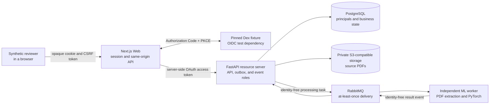
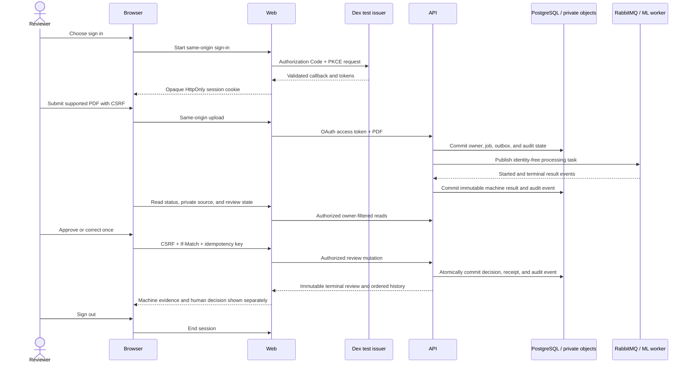

# Architecture documentation

The implemented product is a Document Intelligence and Human Review Platform.
Its completed second vertical slice authenticates one repository-owned
synthetic reviewer, processes supported PDFs through an asynchronous ML
boundary, protects the private source, records one immutable approval or
correction, and exposes an append-only product audit history.

The governing boundaries are [ADR-0007](../adr/0007-authentication-session-and-api-authorization.md)
and [Delivery Specification 0002](../delivery/0002-second-vertical-slice.md).
The public HTTP surface is the
[OpenAPI 3.1 contract](../../packages/contracts/openapi/openapi.yaml), with its
[generated TypeScript representation](../../packages/contracts/generated/api.d.ts).

## System context

The browser reaches only the Web origin. It never receives the private API
base URL, an object-store credential, a durable source URL, or an OAuth token.
Health and readiness probes are intentionally anonymous but expose no document
or identity detail.

## Trust boundaries and ownership

| Boundary | Responsibility | Data deliberately excluded |
|---|---|---|
| Browser | Render state, start sign-in, send same-origin mutations with CSRF, and display source/review/audit results | Access, refresh, and ID tokens; private upstream URLs; object credentials |
| Next.js Web | Validate OIDC callback state, nonce, issuer, and PKCE; own the bounded server session; attach access tokens to API calls | PostgreSQL access, resource-ownership policy, ML implementation |
| Dex fixture | Provide a deterministic loopback OIDC protocol boundary and synthetic reviewer for tests | Production accounts, production credentials, product-owned user storage |
| FastAPI resource server | Validate every bearer token, map `(issuer, subject)` to an API principal, enforce capabilities and ownership, and own all business mutations | Browser-supplied actor authority, end-user tokens in durable state |
| PostgreSQL | Own principals, documents, jobs, outbox rows, immutable review decisions, idempotency receipts, and audit events | Tokens, session cookies, source text, mutable profile copies |
| Private object storage | Hold bounded source PDFs under API-created object identities | Public buckets, browser credentials, durable public URLs |
| RabbitMQ | Carry requested work and result events with stable identities and at-least-once delivery | End-user identity, OAuth claims, source text |
| ML worker | Verify and extract the supported PDF, run the deterministic model, and publish a result event | PostgreSQL access, reviewer identity, review or authorization policy |

`apps/web`, `apps/api`, and `apps/ml` remain independently deployable. Their
only shared application surface is language-neutral material in
`packages/contracts`; they do not import another deployable area's private
implementation.

## Authenticated review sequence

The API derives the actor from the validated access token. A document
identifier or capability alone never grants access. Unknown and cross-owner
documents produce the same public not-found response. The first valid review
write wins; identical retry is stable, conflicting idempotency reuse is
rejected, stale evidence fails its precondition, and no second terminal
decision can overwrite the result.

## Security properties

- OIDC Authorization Code flow uses PKCE, state, nonce, exact callback and
  issuer validation; the implicit and password grants are not supported.
- The browser receives an opaque `HttpOnly`, `SameSite=Lax` cookie. Production-
  shaped configuration requires HTTPS and `Secure`; plaintext is allowed only
  for the explicit loopback fixture.
- State-changing same-origin requests require CSRF verification in addition to
  the session cookie.
- The API independently validates signature, algorithm, issuer, audience,
  time bounds, trusted keys, capabilities, and target ownership.
- Source delivery verifies persisted object identity, size, media type, and
  SHA-256 before returning any PDF bytes, and uses private no-store responses.
- Machine classification, confidence, model version, and terminal processing
  evidence remain immutable and visibly separate from the human decision.
- Verification artifacts are scanned and sanitized before public upload;
  project-scoped teardown remains unconditional.

Safe loopback settings are documented in [`.env.example`](../../.env.example).
They are visibly local and cannot authorize an external system. Private
production client credentials and session secrets are intentionally absent.
The pinned [Dex configuration](../../infra/docker/identity/dex.yaml) and
[synthetic document provenance](../../tests/fixtures/README.md) are repository-
owned fixtures rather than external identities or private source material.

## Verification topology

The same root entrypoint, `python scripts/verify.py`, owns local static and
GitHub-hosted runtime verification. AI-assisted local work uses
`--static-only`; Docker-backed identity, browser, database, broker, object-
storage, and ML proof runs only in GitHub Actions.

The complete runtime proof signs in through real OIDC Code + PKCE, processes an
invoice and a deliberately limited synthetic correction fixture, reads the
private source, proves approval and correction, exercises authentication,
authorization, CSRF, concurrency, idempotency, recovery, and sign-out, scans
public artifacts for private content, and tears down only the
`reactorfront-portfolio` Compose project.

The [workflow summary](../../.github/workflows/README.md) maps identity,
authorization, contracts, ML, review, audit, security-negative, recovery,
coverage, failure evidence, and teardown outcomes to the canonical verifier.
The [verification script documentation](../../scripts/README.md) describes the
same root entrypoint used locally and by GitHub Actions.

Reviewable evidence is recorded in [Issue #27](https://github.com/Kentaro-Ono-jp/Portfolio/issues/27)
and the completion section of
[Delivery Specification 0002](../delivery/0002-second-vertical-slice.md#completion-evidence).

## Known limitations

Completion means that the bounded second vertical slice is reproducible; it
does not claim production readiness.

- Dex is pinned test infrastructure with repository-owned synthetic identity,
  not a selected or operated production identity provider.
- The Web session store is bounded and process-local. Horizontal scaling,
  durable shared sessions, secret management, TLS termination, and persistent
  public hosting remain deployment work.
- The supported source is one text-bearing PDF page of at most 5 MiB. Scanned-
  image OCR, multi-page processing, image upload, range requests, and presigned
  source delivery are not implemented.
- The deliberately small deterministic classifier supports the bounded
  `invoice` and `report` demonstration. Its confidence is not calibrated and
  its synthetic training/evaluation data does not establish production model
  quality.
- Multi-tenancy, organization membership, assignment queues, administration,
  account recovery, MFA, audit search/export/retention/legal hold, and managed
  cloud deployment remain separate product decisions.

## Accepted records

- [ADR-0001: Adopt a modular monorepo](../adr/0001-modular-monorepo.md)
- [ADR-0002: Target an AI-enabled document intelligence platform](../adr/0002-target-document-intelligence-platform.md)
- [ADR-0003: Adopt the initial technology stack](../adr/0003-initial-technology-stack.md)
- [ADR-0004: Keep state ownership in the API and use a transactional outbox](../adr/0004-api-state-ownership-and-transactional-outbox.md)
- [ADR-0007: Define the authentication, session, and API authorization boundary](../adr/0007-authentication-session-and-api-authorization.md)
- [Delivery Specification 0001: First end-to-end vertical slice](../delivery/0001-first-vertical-slice.md)
- [Delivery Specification 0002: Authenticated classification review and immutable audit trail](../delivery/0002-second-vertical-slice.md)
