# Delivery Specification 0003: Human-feedback model evaluation and governed promotion

- Status: Accepted
- Date: 2026-08-02
- Accepted: 2026-08-02
- Owner: ReactorFront
- Tracking issue: [#72](https://github.com/Kentaro-Ono-jp/Portfolio/issues/72)
- Related decisions:
  - [ADR-0001: Adopt a modular monorepo](../adr/0001-modular-monorepo.md)
  - [ADR-0002: Target an AI-enabled document intelligence platform](../adr/0002-target-document-intelligence-platform.md)
  - [ADR-0003: Adopt the initial technology stack](../adr/0003-initial-technology-stack.md)
  - [ADR-0004: Keep state ownership in the API and use a transactional outbox](../adr/0004-api-state-ownership-and-transactional-outbox.md)
  - [ADR-0007: Define the authentication, session, and API authorization boundary](../adr/0007-authentication-session-and-api-authorization.md)
  - [ADR-0021: Govern human feedback, model evaluation, and promotion](../adr/0021-govern-human-feedback-model-evaluation-and-promotion.md)

## Purpose

Deliver the smallest complete learning-and-release loop that joins the first
slice's reproducible ML inference to the second slice's immutable human
review. Prove that a clean runner can reconstruct a versioned synthetic corpus,
measure the current champion, evaluate a candidate without split leakage,
reject an ineligible candidate, promote one exact manifest, and trace later
runtime predictions to the evidence that authorized that model.

This specification does not authorize automatic learning from runtime data.
Human decisions remain API-owned product evidence. They enter model development
only through explicit, provenance-checked, reviewed curation.

This specification is an implementation contract, not a disposable AI prompt.
Its lifecycle is `Proposed` -> `Accepted` -> `In Progress` -> `Completed`.
Retain the plan-to-result history and record focused Issues, PRs, exact-head
reviews, authoritative workflows, merges, limitations, and follow-up slices.

## Outcome

An authenticated synthetic reviewer submits supported single-page PDFs through
the existing Web and API boundary, receives immutable classifications from the
promoted model, and approves or corrects them. A bounded API-owned export
projects only eligible, sanitized review outcomes as feedback candidates. A
reviewed curation change admits repository-owned synthetic examples into an
immutable dataset snapshot with family-disjoint splits.

The ML evaluation path reproduces the champion baseline and a candidate report
from that snapshot. A deterministic policy rejects incomplete, leaking,
regressing, or unverifiable candidates. One reviewed promotion manifest binds
the accepted model artifact to its dataset, pipeline, and evaluation evidence.
Subsequent completed events, API records, review representations, audit
history, and the Web result identify that exact lineage.

```mermaid
flowchart LR
    Reviewer["Synthetic reviewer"] --> Web["Next.js Web"]
    Web --> API["API-owned documents and review"]
    API --> ProductState["PostgreSQL machine and human evidence"]
    ProductState --> Export["Sanitized feedback-candidate export"]
    Corpus["Reviewed synthetic corpus"] --> Snapshot["Versioned dataset snapshot"]
    Export --> Curation["Explicit curation review"]
    Curation --> Snapshot
    Snapshot --> Evaluator["Champion and candidate evaluation"]
    Evaluator --> Report["Canonical evaluation report"]
    Report --> Gate["Quality and lineage gate"]
    Gate --> Manifest["Reviewed promotion manifest"]
    Manifest --> Worker["ML worker image"]
    API --> Broker["RabbitMQ"]
    Broker --> Worker
    Worker -->|"completed.v2 with lineage"| Broker
    Broker --> API
    API --> Web
```



## Scope boundaries

### Included

- the existing `invoice` and `report` classification ontology
- repository-owned synthetic corpus records with explicit provenance
- immutable dataset snapshots with canonical digests
- fixed train, validation, and test assignments separated by source or
  template family
- deterministic duplicate, conflicting-label, source-identity, and family-
  leakage checks
- a machine-readable evaluation policy accepted before candidate fitting
- a reproducible current-champion baseline
- a reproducible candidate build and comparison
- classification and confidence-quality metrics over every held-out sample
- a deliberately rejected candidate or mutated-lineage proof
- one canonical reviewed promoted-model manifest
- deterministic artifact generation and SHA-256 verification
- a bounded sanitized feedback-candidate export owned by `apps/api`
- explicit curation that can admit only matching repository-owned synthetic
  sources
- versioned result-event, persistence, API, review, audit, and Web lineage
- populated-schema migration that preserves legacy machine and review evidence
- complete static, real-service, browser, security-negative, failure, recovery,
  leakage-scan, and project-scoped teardown proof
- public model-development evidence with explicit synthetic-corpus limitations

### Excluded from this slice

- automatic, scheduled, or online retraining from review events
- treating approval, correction, or upload as automatic data consent
- unreviewed runtime documents used for training or evaluation
- private, employer, client, personal, or unlicensed documents and datasets
- production data collection, labeling operations, or annotation workforce
- OCR, image upload, encrypted PDFs, handwriting, and multi-page processing
- field-level structured extraction or field-level correction
- new classification ontologies beyond `invoice` and `report`
- public signup, multi-tenancy, reviewer assignment, bulk review, and
  administration
- production identity-provider selection, durable shared sessions, public
  hosting, AWS, Terraform, Kubernetes, and full observability deployment
- semantic search, `pgvector`, RAG, prompts, generative AI, and foundation-model
  training
- MLflow or another model registry without a separately measured requirement
- canary rollout, shadow traffic, A/B testing, and runtime model switching
- production accuracy, fairness, privacy, robustness, calibration, or
  generalization claims

The slice retains the existing single-page text-bearing PDF boundary. Its new
product value is measured ML lineage and controlled improvement, not broader
input or output support.

## Canonical terms

- **Machine result:** the immutable classification, score, and lineage emitted
  by the worker and persisted by the API.
- **Human decision:** the immutable approval or correction persisted separately
  from the machine result.
- **Feedback candidate:** a sanitized reference showing that an eligible
  repository-owned source received a terminal human decision. It is not yet a
  dataset member.
- **Dataset snapshot:** one immutable corpus manifest with provenance, labels,
  family identity, fixed splits, and a canonical digest.
- **Champion:** the model named by the currently accepted promotion manifest.
- **Candidate:** a reproducible model evaluated for possible promotion.
- **Evaluation report:** the canonical complete output of one model, dataset,
  split, pipeline, and policy combination.
- **Promotion manifest:** the sole reviewed repository record selecting the
  model artifact built into the ML worker.
- **Lineage:** the dataset, preprocessing, pipeline, model, artifact, policy,
  and evaluation identities required to explain one machine result.

## Functional contract

### Corpus provenance and snapshot identity

Every corpus sample must declare a stable sample ID, supported label, source
SHA-256, provenance class, compatible license or repository-ownership marker,
and a source or template family. Paths are repository-relative and portable.
The corpus contains no person, client, employer, credential, account, or
machine-local data.

One canonical manifest assigns every admitted sample to exactly one of
`train`, `validation`, or `test`. The assignment is stable for the snapshot.
Related source or template families cannot cross splits. Candidate code cannot
modify the held-out test membership in the same focused increment that fits or
promotes that candidate.

The snapshot digest is calculated from canonical UTF-8 JSON with documented
ordering and normalization. Changing content, label, provenance, family,
split, schema, or included sample changes the digest and dataset version.

Verification rejects:

- duplicate sample IDs or source digests;
- conflicting labels for one normalized source identity;
- exact or normalized-content duplicates across splits;
- one template or source family present in more than one split;
- a missing source, unsupported label, unknown provenance, incompatible
  license, or noncanonical manifest; and
- a snapshot whose declared digest does not match its canonical bytes.

### Feedback-candidate boundary

The API remains the sole owner of review and source metadata. A bounded
API-area command may inspect terminal review records and produce a sanitized
candidate document. It is not a Web endpoint, a fourth deployable area, or an
ML database client.

An exported candidate contains only a stable candidate identity, source
SHA-256, machine classification, final classification, review outcome, and
machine lineage needed for curation. It excludes source bytes and text,
original filenames, document and job identifiers, correlation identifiers,
principal identifiers, token claims, timestamps, comments, and database keys.

Only a source digest already present in the reviewed synthetic-corpus inventory
is eligible. Unknown or conflicting sources are omitted with a stable aggregate
reason and no sensitive detail. Repeated export over unchanged API state is
canonical and byte-identical.

Curation compares candidates with the corpus inventory and creates a normal
reviewed repository change. No exporter writes the training manifest, changes
a split, trains a model, or updates the promotion manifest automatically.

### Evaluation policy and baseline

Before candidate fitting, a focused reviewed increment must publish:

- the corpus snapshot and family-disjoint split;
- the evaluation-report schema;
- the exact metric definitions and normalization rules;
- absolute candidate gates;
- champion-relative regression limits;
- confidence-quality and abstention behavior;
- determinism tolerance; and
- the complete current-champion baseline.

The required report includes dataset and split digests, pipeline and model
identity, artifact SHA-256, policy version, total and processed sample counts,
confusion matrix, per-class precision/recall/F1, macro F1, the selected
confidence-quality measure, sanitized failure counts, and the canonical report
digest.

Every declared test sample must produce exactly one accepted prediction or one
declared sanitized failure. A partial run, missing class, non-finite metric,
unknown prediction, altered test identity, or unverified artifact fails closed.

The first evaluation increment fixes numeric absolute and relative gates before
candidate implementation. A candidate-focused increment cannot weaken those
gates, change test families, or replace the champion baseline. Such a material
change returns through focused design and requires separate review before a new
candidate is fitted.

### Candidate build and confidence treatment

Candidate generation is deterministic on the pinned CPU build path. The build
records its algorithm and schema version, seed, dataset digest, preprocessing
and pipeline versions, dependency identity, and artifact SHA-256. Generated
model artifacts remain outside normal Git history.

Training uses only the declared training split. Hyperparameter selection and
any confidence treatment use only training and validation data. The held-out
test split is evaluated only by the accepted comparison path.

If the candidate introduces confidence calibration, the procedure is fitted on
validation data and evaluated on the test split with the predeclared measure.
Without that complete path, the UI and documentation must call the value a
model score or confidence output and must not call it calibrated probability.

Two clean evaluations of the same artifact and snapshot must produce the same
canonical report within the accepted deterministic tolerance. Artifact or
report drift is blocking evidence, not a reason to update the expected digest
automatically.

### Promotion and rollback

One canonical promotion manifest binds the supported ontology, model version,
artifact schema and SHA-256, dataset version and digest, preprocessing and
pipeline versions, evaluation-policy version, and evaluation-report digest.

Promotion is a reviewed repository mutation. It is accepted only when:

- the candidate report is complete and canonical;
- every absolute and champion-relative gate passes;
- corpus and split leakage checks pass;
- the artifact is reproducible from the declared snapshot;
- contract, security, supply-chain, and regression verification pass; and
- the manifest names exactly the evaluated artifact and report.

An ineligible candidate cannot mutate the manifest. A conflicting reuse of a
model, dataset, report, or artifact identity is rejected. Failed promotion
proof leaves the champion unchanged.

The ML image generates and verifies the promoted artifact during its build.
Startup and readiness fail when the manifest, artifact, dataset, pipeline, or
report identity is missing or inconsistent. Runtime does not fall back to an
unverified newest artifact.

Rollback is another reviewed manifest change selecting a previously accepted
lineage. It does not erase the rejected candidate, rewrite prior results, or
alter completed reviews and audit events.

### Runtime event and persistence lineage

New workers publish a versioned completed-result event that contains complete
lineage. The existing `document.processing.completed.v1` schema remains
immutable. A new `document.processing.completed.v2` contract carries at least:

- dataset version and SHA-256;
- preprocessing and pipeline versions;
- model version and artifact SHA-256;
- evaluation-policy version and report SHA-256; and
- the existing document, job, source-integrity, classification, confidence,
  event, occurrence, and correlation identities.

The API result consumer accepts only canonical supported event versions. It
includes lineage in the logical event digest, validates it before persistence,
and retains event-ID reuse, first-terminal-result, ordering, duplicate,
poison-input, and transactional receipt guarantees.

Populated-schema migration preserves existing first- and second-slice results
without fabricating dataset or evaluation evidence. Legacy results remain
explicitly `legacy-unmeasured`; new v2 results require complete measured
lineage. Migration forward and backward must preserve documents, jobs, source
identity, principals, review decisions, receipts, and audit history.

Machine lineage is immutable after terminal result persistence. Human approval
or correction continues to preserve the original machine classification,
score, and lineage and stores the human decision separately.

### API, Web, and audit representation

The OpenAPI contract and generated TypeScript types expose a discriminated
model-evidence representation:

- legacy completed records explicitly report `legacy-unmeasured`; and
- new promoted results report the bounded complete lineage and measured status.

The review representation repeats the exact immutable machine lineage needed
to bind the ETag and human decision. Changing any machine-evidence identity
changes the strong entity tag. Review idempotency and concurrency semantics do
not weaken.

The API records a sanitized processing-completed audit detail version for the
new lineage. It contains version and digest identities but no source text,
filename, corpus sample, actor claim, token, local path, or raw evaluation
payload. Existing audit events remain unchanged.

The authenticated Web result shows a compact evidence panel that distinguishes
the model score from measured corpus quality and links the prediction to its
dataset, pipeline, model, artifact, and evaluation identities. It does not
provide model promotion, dataset editing, or raw feedback export controls.

### Required failure behavior

Use stable sanitized failure codes and preserve prior evidence for at least:

- invalid corpus provenance or licensing marker;
- duplicate, conflicting, or leaking sample identity;
- noncanonical snapshot or digest mismatch;
- partial, non-finite, or non-deterministic evaluation;
- incomplete metric or failed absolute/relative gate;
- artifact, report, or promotion-manifest mismatch;
- conflicting version or digest reuse;
- missing runtime promoted manifest;
- completed.v2 event with incomplete or invalid lineage;
- legacy result falsely presented as measured;
- ineligible feedback candidate or unsafe export field; and
- rollback or failure that attempts to rewrite prior machine or human evidence.

Raw source text, review identity, database values, model parameters, tracebacks,
paths, broker bodies, and credentials must not enter public problems, Web
errors, logs, reports, workflow summaries, or uploaded artifacts.

## Pre-implementation gates

Before application implementation begins:

- accept ADR-0021, this specification, and umbrella Issue #72;
- record the current model, artifact digest, dataset, model card, and canonical
  runtime behavior as the champion baseline identity;
- accept the corpus provenance vocabulary and dataset-manifest schema;
- freeze family-disjoint splits and exact numeric evaluation gates in a focused
  increment before fitting a candidate;
- define canonical JSON and digest rules for snapshots, reports, and manifests;
- define completed.v2 compatibility and populated-schema migration behavior;
- define the sanitized feedback-export allowlist and leakage-negative proof;
- document the no-calibration-claim default; and
- keep every new dependency out until a measured requirement proves it earns a
  place.

## Delivery steps

### Step 1: Accept the model-lifecycle planning baseline

Deliver ADR-0021, this Delivery Specification, delivery-index routing, public
README direction, and umbrella Issue #72 without changing runtime behavior.

Acceptance requires consistent outcome, scope, non-targets, failure model,
proof plan, and terminology across every planning surface. Current second-slice
behavior and limitations remain truthful.

### Step 2: Establish corpus, evaluation policy, and champion baseline

Deliver the reviewed synthetic corpus inventory, immutable snapshot, fixed
family-disjoint splits, leakage detector, report schema, evaluator, numeric
quality policy, and current-model baseline.

Acceptance requires deterministic clean reconstruction, complete evaluation of
every held-out sample, canonical digests, pass/fail mutation tests for every
leakage class, and explicit bounded claims. No candidate is fitted or promoted
in this step.

### Step 3: Build and evaluate the smallest candidate

Deliver a deterministic candidate training path, any validation-only
confidence treatment, canonical comparison report, artifact identity, and
promotion eligibility decision.

Acceptance requires reproducible artifacts and reports, passing absolute and
champion-relative gates, a proved rejected candidate, no test-set fitting, and
no automatic manifest mutation.

### Step 4: Carry immutable lineage through the runtime

Deliver completed.v2 JSON Schema and examples, API parsing and persistence,
OpenAPI and generated Web types, populated-schema migration, review ETag
binding, audit-detail versioning, and compatibility for explicit legacy results.

Acceptance requires full event-contract drift checks, real PostgreSQL migration
forward/backward proof, duplicate and conflicting-redelivery proof, first-
terminal preservation, and no fabricated lineage for old records.

### Step 5: Add bounded feedback curation

Deliver the API-owned sanitized feedback-candidate command, repository-corpus
eligibility check, canonical output, explicit curation procedure, and public-
safety negative tests.

Acceptance requires byte-identical repeat export, omission of every unapproved
field, rejection of unknown or conflicting sources, absence of actor and source
content, and proof that export alone cannot alter a dataset or model.

### Step 6: Govern promotion, runtime selection, and rollback

Deliver one canonical promoted-model manifest, build-time artifact generation
and verification, readiness checks, evaluated-candidate selection, and a
reviewed rollback path.

Acceptance requires the exact evaluated artifact to run, mismatched and newest-
unverified artifacts to fail closed, an ineligible candidate to leave the
champion untouched, and rollback to preserve all historical evidence.

### Step 7: Prove the authenticated evidence experience

Deliver the bounded Web model-evidence panel and the complete authenticated
browser path over real synthetic PDFs. The flow must cover a promoted champion
result, approval, correction, exact lineage, ordered audit history, a legacy-
unmeasured representation, and stable recovery guidance.

Acceptance requires API, Web, real-service, Playwright, security-negative,
restart, redelivery, leakage-scan, and project-scoped teardown proof without a
GitHub Secret, maintainer login, local Docker state, or external private data.

### Step 8: Publish visible reproducible evidence

Publish the final model card, bounded evaluation summary, architecture and
security updates, exact reviewed-head verdict, authoritative clean and cold-
cache workflows, merge and merged-main evidence, accepted limitations, and the
completed specification record.

Public evidence must distinguish measured synthetic-corpus results from
production claims and must not expose raw task conversations, machine-local
paths, source text, actor identity, tokens, credentials, or unfiltered failure
artifacts.

## Verification plan

The canonical root entrypoint remains:

```console
python scripts/verify.py --static-only
```

for local AI-agent work and:

```console
python scripts/verify.py
```

inside authoritative GitHub Actions.

The selector must add ML-evaluation and affected contract/application proof to
the existing groups rather than creating a competing root workflow. The full
clean-runner path must:

1. reconstruct and validate the corpus and fixed split;
2. reproduce the champion baseline;
3. generate and evaluate the candidate twice;
4. reject leakage and a deliberately ineligible candidate;
5. verify the promoted manifest and artifact digest;
6. migrate a populated second-slice database;
7. start the complete repository-owned Compose environment;
8. process authenticated real synthetic PDFs through the promoted worker;
9. prove completed.v2 lineage, legacy representation, review, audit,
   duplication, mismatch, restart, and rollback behavior;
10. run the browser evidence flow and security-negative matrix;
11. sanitize and upload only bounded diagnostics; and
12. unconditionally tear down only the `reactorfront-portfolio` project.

No Docker-backed evidence is run by an AI agent on local Docker Desktop.

## Planned reviewable increments

1. Accept ADR-0021, this specification, delivery routing, public direction, and
   umbrella Issue #72 as the planning baseline.
2. Add the versioned corpus, split manifest, leakage detector, report contract,
   evaluator, numeric policy, and current champion baseline.
3. Add the deterministic candidate, confidence treatment, comparison policy,
   artifact identity, and reviewed promotion manifest.
4. Add completed.v2, migrations, API persistence, audit semantics, generated
   Web contracts, legacy compatibility, and sanitized feedback candidates.
5. Add the authenticated Web evidence experience and complete runtime,
   security-negative, failure, rollback, and recovery proof.
6. Publish final public evidence, exact workflow lineage, known limitations,
   follow-up slices, and the completion record.

Each increment uses one focused Issue, branch, Draft PR, normal exact-head
Actions proof or an applicable governed qualified limitation, independent
review, owner-authorized merge, merged-main proof or the corresponding
qualified limitation, and evidence reconciliation. A machine-qualified
Markdown-only exception may intentionally produce no workflow run; that
absence is never passing evidence and must satisfy its complete exception
contract. The umbrella Issue is the accumulated ledger; it is not permission
to implement the complete slice as one bulk change.

## Definition of done for the complete slice

- [ ] ADR-0021 and this specification remain accepted and aligned.
- [ ] Every corpus sample has reviewed provenance, label, family, split, and
  digest identity.
- [ ] Duplicate, conflicting-label, source-identity, and family leakage fail
  deterministically.
- [ ] The evaluation policy and champion baseline precede candidate fitting.
- [ ] Champion and candidate reports are complete, canonical, and reproducible.
- [ ] Exact numeric absolute, relative, confidence, and completeness gates are
  enforced without candidate-local weakening.
- [ ] At least one ineligible candidate or corrupted-lineage case is rejected
  without changing the champion.
- [ ] The promoted manifest binds the exact dataset, pipeline, artifact, policy,
  and report used by runtime.
- [ ] Feedback export is synthetic-only, canonical, minimal, and cannot train or
  promote automatically.
- [ ] Completed.v2 lineage is validated and persisted atomically with event
  receipt and terminal result.
- [ ] Existing results remain explicit legacy evidence without fabricated
  lineage.
- [ ] Review ETags, idempotency, concurrency, immutable machine evidence, and
  append-only audit history remain correct.
- [ ] The Web distinguishes one model score, measured corpus evidence, and a
  human final decision.
- [ ] Static, real-service, browser, security-negative, recovery, rollback,
  migration, leakage-scan, and teardown proof pass from a clean runner.
- [ ] Public evidence states exact metrics and limitations without production
  quality, calibration, fairness, privacy, robustness, or generalization claims.
- [ ] Every focused Issue, PR, exact-head verdict, workflow, merge, and
  merged-main result is recorded in Issue #72 and this completion record.

## Current accepted limitations

- The current promoted model remains the completed second-slice classifier
  until a later focused increment proves and promotes a candidate.
- The accepted corpus will be synthetic and bounded; its future metrics will
  not establish real-world document quality.
- The input remains one text-bearing PDF page of at most 5 MiB.
- The task remains binary `invoice` or `report` classification.
- Review remains one terminal decision per completed document.
- The identity provider remains a loopback-only deterministic test fixture.
- Sessions remain process-local and the repository remains an unhosted public
  engineering record.
- Full observability infrastructure and managed cloud deployment remain future
  product decisions.

## Completion evidence

Not yet available. Record each focused Issue, PR, exact reviewed head,
authoritative workflow, squash merge, merged-main workflow, reconciliation,
accepted limitation, and final cold-cache proof here as the slice advances.

## Follow-up slices

No follow-up is accepted by this planning record. Candidate later slices may
address structured field extraction and correction, OCR and multi-page input,
managed deployment and observability, or multi-user review operations only
after returning through focused design.

## Change control

Changes to the outcome, task ontology, data-admission boundary, split policy,
quality authority, promotion model, runtime lineage, privacy boundary, or
deployment scope are material. Update ADR-0021 or this specification, record
the changed boundary in Issue #72, and obtain owner selection before
implementation continues.
