# Delivery Specification 0004: Portable managed-ephemeral AWS deployment proof

- Status: Completed
- Date: 2026-08-09
- Accepted: 2026-08-09
- Completed: 2026-08-12
- Owner: ReactorFront
- Tracking issue: [#95](https://github.com/Kentaro-Ono-jp/Portfolio/issues/95)
- Related decisions:
  - [ADR-0001: Adopt a modular monorepo](../adr/0001-modular-monorepo.md)
  - [ADR-0003: Adopt the initial technology stack](../adr/0003-initial-technology-stack.md)
  - [ADR-0004: Keep state ownership in the API and use a transactional outbox](../adr/0004-api-state-ownership-and-transactional-outbox.md)
  - [ADR-0007: Define the authentication, session, and API authorization boundary](../adr/0007-authentication-session-and-api-authorization.md)
  - [ADR-0023: Adopt a portable managed-ephemeral AWS deployment profile](../adr/0023-portable-managed-ephemeral-aws-deployment.md)

## Purpose

Deliver the smallest complete managed-cloud lifecycle that proves the existing public, MIT-licensed, locally reproducible portfolio can be built from the same clone into an independently owned AWS account, exercised through its authenticated asynchronous document path, and completely removed without relying on maintainer-private infrastructure or credentials.

The maintainer proof is intentionally ephemeral rather than an always-on product. It builds a fresh managed environment for a bounded monthly or manual window, migrates and seeds it from repository-owned sources, proves the end-to-end behavior, exposes it briefly over HTTPS, destroys billable application resources, and checks for residue. A third party can perform the same lifecycle in their own AWS account.

This specification does not replace GitHub evaluation or local Docker Compose. It adds a third deployment experience while preserving both existing paths.

This specification is an implementation contract, not a disposable AI prompt. Its lifecycle is `Proposed` -> `Accepted` -> `In Progress` -> `Completed`. The umbrella Issue is the accumulated live ledger; each reviewable increment uses one focused Issue, branch, Draft PR, successful exact-head authoritative workflow or complete governed qualified limitation, Publication Gate B and Implementation Prune Stage B against that applicable evidence source, independent review, owner-authorized merge, merged-main authoritative workflow or corresponding complete governed qualified limitation, and reconciliation. Workflow absence is a limitation and never passing evidence.

## Current implementation state

The planning baseline and Step 2 runtime-compatibility boundary are implemented: explicit local/AWS S3 modes preserve MinIO while proving the boto3 task-role credential path; Cognito-shaped Web/API OIDC retains Dex while requiring access-token purpose and group mapping; a digest-pinned RabbitMQ 4.2 route repeats the complete API/ML runtime proof; and exact-head Actions records measured container evidence against bounded initial Fargate candidates.

Step 3 now defines the persistent portable bootstrap: an encrypted, versioned, public-blocked S3 backend with S3 lockfile and deterministic local-to-remote state adoption; independent immutable Web/API/ML ECR repositories with bounded cleanup; one quota-checked fixed Permissions Boundary; environment-isolated operator, IAM-manager, automation, task-execution, Web/API/ML workload, Scheduler, CodeBuild, and destroy authorities; exact trust and pass-role contracts including an event-bound customized GitHub OIDC subject; and repository-owned AWS-free mock-plan plus allowed/denied and delegated-authority simulation proof. The fixed boundary is a durable service/purpose, persistent-resource, IAM-mutation, and exact-PassRole guardrail. Bootstrap-owned inline identity policies, which delegated roles cannot replace, enforce exact generated-resource ownership; static proof reports identity, boundary, and their effective intersection without pretending that the deliberately wider boundary duplicates every ownership predicate. This owner-selected rule is recorded in [umbrella #95](https://github.com/Kentaro-Ono-jp/Portfolio/issues/95#issuecomment-5230632458).

The maintainer path now freezes deployment IAM as a persistent static
prerequisite. One separately approved owner-admin Console operation installs or
updates the canonical user, roles, trusts, managed policies, attachments, and
boundary after repository-owned quota proof. Normal deployment verifies either
the existing credential-only source user or the exact short-lived GitHub
automation session, assumes the exact environment operator, and performs
exact-ARN read-only attestation against canonical document hashes. It cannot
generate, attach, version, repair, or otherwise mutate IAM, cannot
recalculate IAM quota, and cannot invoke bootstrap IAM. Drift fails closed and
returns to a separate static-IAM maintenance increment.

Step 4 now defines the independent environment state root and its NAT-free VPC, two generated API Gateway HTTP APIs plus one VPC Link and SRV-only Cloud Map ingress, distinct Web/API-area/ML Fargate services, RDS PostgreSQL 18, encrypted application S3 bucket, Amazon MQ RabbitMQ 4.2, Cognito Authorization Code/PKCE managed login, generated Secrets Manager values, bounded CloudWatch logs, exact ownership tags, and portable outputs. The Web reaches the second API only through its generated HTTPS endpoint; the shared VPC Link has exact Security Group edges to the Web and API ports. The root consumes only explicit persistent-bootstrap references, pins every image by digest, gives no database or end-user identity to ML, and is validated by mock-provider tests plus a fail-closed sanitized plan against an unreachable endpoint. Its verifier process makes zero AWS API calls, writes, or resources, but those explicitly verifier-scoped zeros exclude the real AWS history below and are not Issue-wide totals.

Step 5 now defines a single TTL-first lifecycle command surface, a persistent
artifact-free CodeBuild image builder, and a persistent Scheduler/CodeBuild
destroy controller outside the environment state. The controller consumes the
frozen static IAM contract, uses an S3 conditional lease plus ETag checkpoints,
registers and reads back a normal one-hour fallback before apply, retains an
explicit/extend maximum of two hours, and keeps that fallback until Terraform
plus exact-image, service, and tag inventory
prove zero residue. The destroy project keeps two static automatic retries for
failures after Scheduler has successfully delivered the CodeBuild start call.
The lifecycle has no deployment-time IAM mutation, quota calculation, policy
generation, or private deployment-configuration dependency.
The exact image CodeBuild project's repository-owned inline buildspec is the
sole non-IAM controller-maintenance exception: only when every other project
field already matches may the operator synchronize that one field and read
back its normalized SHA-256. Destroy-project, service-role, IAM, and any other
controller drift still fail closed.

An owner-authorized exploratory AWS evaluation historically consumed the
governed `3/3` billable construction attempts while exposing provider-dependent
authorization requirements; none reached a green environment. The partial
environment was destroyed through the separate destroy role, Terraform state
returned to zero, a fresh live plan returned 81 creates with no update or
delete, and tag plus service-specific inventory found zero application residue.
Issue #114 supersedes the old numeric attempt ceiling with its
completion-first serialized-attempt boundary. The `3/3` notation remains
immutable history, not a current cap. Issue #116 implements the repository
contract for the exact GitHub OIDC workflow, isolated manual/monthly callers,
one-hour normal safety fallback, and no per-run environment approval. Its live
manual and real-schedule proofs both passed authenticated asynchronous smoke,
immediate destroy, and 27-category zero residue; the temporary proof schedule
was then removed. Final runtime CI and Publication Gate B passed at PR #128's
preceding reviewed head; its documentation-only correction head uses the
governed Markdown-only exception. Independent re-review approved exact head
`b8051e970f33a0a2920f41cfb55b27e8cce1b1d1`; PR #128 merged as
`a4ff417a00ec087391da785f9ee0918aaf08fef0` with an identical tree and a
complete no-run limitation. Issue #116 is closed and reconciled.

Issue #129 completes Step 8 with the reorganized root README and the canonical
[portable managed-ephemeral AWS operations guide](../../AWS_OPERATIONS_GUIDE.md).
The guide provides the hiring-oriented visual layer, ordered third-party
route, local/AWS and persistent/ephemeral mapping, lifecycle and recovery,
human verification checklist, cost/security/quota/limitation boundary, exact
focused history, Issue #116 PR chain, real-AWS proof, and sanitized current
state. Publication is Markdown-only and creates no new AWS or GitHub Actions
execution. Issue #114 completed the Step 7 real-AWS cycle described below.

## Outcome

From one public repository clone, an authorized operator can:

1. verify local tools, the exact source identity, exact operator assumption,
   frozen static-IAM attestation, region, expected cost, and state backend;
2. consume already-installed bounded deployment roles and persistent low-cost
   control resources without changing IAM or creating a shared maintainer
   account dependency;
3. build and identify immutable application images;
4. register a normal one-hour automatic destroy fallback before billable application creation;
5. apply the managed AWS environment with Terraform;
6. complete database migration, synthetic identity/data seed, health checks, and the authenticated document-processing smoke path;
7. reach the Web over an AWS-provided HTTPS endpoint;
8. destroy the environment and its exact published image digests through the
   same operation surface; and
9. prove that no image, tagged, or service-specific billable application
   residue remains.

The one-hour value is the normal independent safety deadline measured from
actual fallback registration. A successful lifecycle does not wait for that
deadline: it refreshes its cleanup session and destroys immediately after the
authenticated smoke path. Explicit TTL values and `extend` retain the original
120-minute maximum.

The repository continues to support AWS-free GitHub Actions verification and AWS-free local Docker Compose execution.

```mermaid
flowchart LR
    Owner["One-time owner-admin static IAM maintenance"] --> Frozen["Frozen persistent IAM contract"]
    Clone["Public repository clone"] --> Source["Verify exact source identity"]
    Source --> Assume["Assume exact operator role"]
    Frozen --> Attest["Read-only static IAM attestation"]
    Assume --> Attest
    Attest --> Preflight["Lifecycle preflight and cost boundary"]
    Preflight --> TTL["Register destroy fallback first"]
    TTL --> Terraform["Terraform managed environment"]
    Terraform --> Gateway["API Gateway HTTPS"]
    Gateway --> Web["ECS/Fargate Web"]
    Web --> API["ECS/Fargate API area"]
    API --> DB["RDS PostgreSQL"]
    API --> Queue["Amazon MQ RabbitMQ"]
    Queue --> ML["ECS/Fargate ML worker"]
    API --> Objects["Amazon S3"]
    ML --> Objects
    Identity["Amazon Cognito"] --> Web
    Smoke["Authenticated synthetic smoke"] --> Gateway
    Smoke --> Destroy["Manual destroy"]
    TTL --> Destroy
    Destroy --> Sweep["Residual-resource sweep"]
```

## Scope boundaries

### Included

- a new accepted AWS deployment ADR and this Delivery Specification 0004
- one umbrella/tracking Issue and as many bounded focused Issues as the accepted increments require
- reusable Terraform for persistent bootstrap and ephemeral environment layers
- S3 remote state with versioning, encryption, Block Public Access, and S3 lockfile
- least-privilege operator, IAM manager, automation, task execution, workload, Scheduler, and destroy roles with a fixed Permissions Boundary where applicable
- ECR image repositories with immutable digest selection and lifecycle cleanup
- API Gateway HTTP API default HTTPS endpoint, VPC Link, and AWS Cloud Map service discovery
- a NAT-free VPC profile with public outbound-only Fargate task networking and isolated RDS/MQ subnets
- independent Web, API-area, and ML ECS/Fargate services; migration remains an API-area init role
- RDS for PostgreSQL 18, Amazon S3, Amazon MQ for RabbitMQ, and Amazon Cognito managed login
- S3 application adapters that use task-role credentials in AWS and preserve MinIO credentials locally
- Cognito-compatible authorization endpoint trust, PKCE, resource-bound access-token audience, access-token purpose, and group capability mapping
- explicit secret injection without application access keys
- deploy, status, extend, destroy, and residual-sweep commands with stable sanitized output
- monthly scheduled proof and manual on-demand execution using the same modules with isolated names/state/tags
- a destroy fallback registered before billable application resources and retained outside the ephemeral state
- repository-owned synthetic migration, seed, health, authentication, upload, outbox, ML, result, review, and audit proof
- exact cost assumptions, TTL, log retention, object lifecycle, API throttling, and known limitations
- at least one complete real-AWS apply-to-sweep cycle with authoritative, sanitized, public evidence

### Excluded from this slice

- always-on service availability or a general public SaaS offering
- sharing the maintainer AWS account, IAM users, credentials, private state, or
  machine-local operational files
- any public deployment path that requires the maintainer's AWS account or local machine
- high availability, Multi-AZ database/broker, disaster recovery, cross-region failover, or commercial SLA claims
- Kubernetes, EKS, Helm, service mesh, or a platform rewrite
- NAT Gateway as a default requirement for the short-lived proof profile
- custom domain, Route 53 hosted zone, ACM certificate, CloudFront, WAF, or ALB unless a measured blocker requires a focused redefinition
- a low-cost single-host economic profile; it may be a later optional deployment mode
- public signup, multi-tenancy, customer identity administration, or unbounded demo access
- production documents, personal data, employer/client data, or non-synthetic public proof inputs
- automatic model retraining, online learning, new ML ontology, OCR, or multi-page expansion
- permanent database, broker, application object, snapshot, or monthly environment retention
- treating a Budget alert as an automatic spending stop

## Architecture constraints

- Preserve `apps/web`, `apps/api`, and `apps/ml` as independent deployable areas.
- Preserve API ownership of PostgreSQL application state and transactional-outbox behavior.
- Keep the ML area without PostgreSQL credentials or end-user identity.
- Keep Web as the only browser-facing application boundary; API and ML remain private.
- Keep local MinIO and Dex as deterministic local/CI fixtures rather than production dependencies.
- Use standard AWS role credentials in workloads; never inject long-term access keys into ECS tasks.
- Keep IAM-user, account, Organizations, Billing-write, and administrator management outside deployment roles.
- Bind `iam:PassRole` to exact workload role ARNs and `iam:PassedToService` conditions.
- Keep public tasks unreachable from the Internet through Security Group inbound rules even when public IPs provide outbound access.
- Do not create a NAT Gateway in the initial ephemeral profile.
- Select immutable image digests, bounded log/object retention, deletion-safe names, complete tags, and explicit expiration for every environment.
- Keep the automatic destroy controller outside the state it destroys.
- Do not allow normal PR, fork PR, Dependabot, or main-merge CI to obtain AWS deployment authority.
- Keep AWS deployment restricted to an explicit manual action or the accepted monthly schedule.

## Public/private boundary

The portable implementation and documentation are complete from the public
repository alone. No public file links to or reads maintainer-private
operational files. Third-party users bootstrap roles in their own account and
own all resulting cost and state.

The maintainer may use a private operational overlay for account-specific caller profiles, secrets, Budget state, deploy-attempt ledger, and post-destroy inventory. That overlay is never a runtime, Terraform, CI, or documentation input and is excluded from public evidence.

## Failure model

The slice fails closed when any of the following is absent, inconsistent, stale, or unverifiable:

- exact AWS account/role/region boundary;
- remote-state bucket, state key, lock, encryption, or source identity;
- image digest, Terraform version/provider lock, or configuration schema;
- Permissions Boundary, exact pass-role target, or automation trust condition;
- cost estimate, Budget precheck, TTL registration, or environment expiry;
- RDS/MQ readiness, migration completion, Cognito token boundary, S3 task-role access, or ECS health;
- expected `aud`, `token_use=access`, issuer, signature, time, or reviewer-group capability;
- authenticated end-to-end smoke result and synthetic-only proof identity;
- manual destroy result, automatic fallback availability, or residual-resource sweep;
- exact review endpoints, the applicable exact-head evidence source,
  Publication Gate B/Stage B result, or complete selected, executed, carried,
  and skipped group and test-file N/NN inventory;

Apply failure is recorded as one maintainer construction attempt once billable
application resource creation begins. It must leave the pre-registered fallback
able to destroy partial state. A failed destroy is blocking evidence, not
permission to forget or recreate the environment. A missing workflow, delayed
schedule, Budget email, or `terraform destroy` exit code alone is never proof
that resources are gone.

Public errors, logs, workflow summaries, plans, artifacts, Issues, and PRs must not contain credentials, state contents, database/broker passwords, user passwords, account-specific private notes, local paths, source bytes, extracted text, or unfiltered provider errors.

## Cost and deployment-attempt boundary

- Git commits, PRs, merges, local tests, static verification, Terraform validation, read-only inventory, and plan-only work do not count as a deploy attempt.
- Issue #114 permits the serialized apply/deploy/retry attempts reasonably
  required to complete one green lifecycle; it has no numeric attempt ceiling.
  Every failed partial apply still counts and is recorded truthfully.
- The existing `$9` warning and `$10` Budget value are non-blocking observation
  settings for Issue #114. They are not deleted or modified, and they do not
  replace TTL, destroy authority, serial isolation, or rational cost control.
- Construction begins only after topology, current price observation, IAM
  simulation, schedule-first fallback, manual destroy, and residual sweep are
  implemented and rehearsed without billable application creation where possible.
- One cycle becomes green only after apply, migration/seed, health and authenticated smoke, necessary external HTTPS verification, destroy, and residual sweep all complete.
- General self-host documentation must publish service-level cost drivers and make clear that all cost belongs to the deploying account.

## Pre-implementation gates

Before billable AWS application-resource deployment begins:

- accept the deployment ADR, this specification, delivery-index routing, and umbrella Issue through a planning focused increment;
- test the AWS-mode S3 credential chain while retaining local MinIO regression coverage;
- test Cognito's distinct issuer/authorization origins, PKCE, resource-bound `aud`, `token_use=access`, and `cognito:groups` without accepting an ID token as an API access token;
- pass the complete Celery request/result, retry, redelivery, and recovery path against RabbitMQ 4.2;
- measure application container memory and fix Fargate CPU/memory values;
- verify exact regional RDS engine/class/storage and Amazon MQ engine/instance availability;
- calculate the selected topology with current official regional prices and a partial-failure residue case;
- finalize the resource naming, ARN, path, tag, state-key, and `iam:PassRole` boundaries;
- simulate allowed and denied actions for operator, IAM manager, task, automation, and destroy roles;
- separate unattended read-only discovery from explicitly authorized AWS write
  execution paths;
- prove that TTL fallback registration precedes billable apply and is not owned by the destroyed environment state; and
- define the residual inventory matrix for every chargeable service used.

## Delivery steps

### Step 1: Accept the fourth-slice planning baseline

Deliver the deployment ADR, Delivery Specification 0004, delivery-index routing, public direction update, and umbrella Issue without changing runtime behavior or creating AWS application resources.

Acceptance requires one coherent outcome, scope, non-targets, topology, failure model, cost boundary, deploy-attempt boundary, proof plan, and deliberate separation between public portable inputs and private maintainer operations.

### Step 2: Adapt application boundaries to managed AWS services

Deliver AWS task-role S3 access with local MinIO compatibility, Cognito-compatible Web/API OIDC validation, RabbitMQ 4.2 compatibility proof, and measured container sizing.

Acceptance requires local and canonical CI paths to remain AWS-free, static credentials to be absent from AWS task configuration, ID-token substitution to fail, group capability mapping to pass, and the existing outbox/result/recovery contracts to remain intact.

Implementation keeps the ordinary Compose profile on MinIO, Dex, and its
normal RabbitMQ image. AWS mode rejects explicit S3 credentials and endpoints,
Cognito mode requires strict resource audience, `token_use=access`, and
`cognito:groups`, the RabbitMQ 4.2 overlay receives the complete API/ML runtime
rehearsal, and the canonical browser workload emits exact-head sizing evidence
for every deployable process. This compatibility proof creates no AWS resource
and does not claim Terraform or live-AWS validation.

### Step 3: Establish portable bootstrap, state, and least privilege

Deliver the remote-state bootstrap, ECR lifecycle, Permissions Boundary, operator/IAM-manager/task/automation/destroy roles, trust policies, explicit pass-role boundaries, and policy simulation.

Acceptance requires a new account owner to bootstrap independently, every privileged action to have an exact purpose, administrator/user/credential/account changes to remain denied, exact generated-resource ownership to be enforced by bootstrap-owned non-replaceable identity policies and their effective boundary intersection, and public examples to contain no maintainer identity or secret. The one fixed boundary must retain useful managed-policy quota headroom rather than duplicating every service-specific ownership predicate.

For the maintainer account, acceptance additionally requires a frozen
Console-owned static IAM contract. Static quota work and IAM changes occur only
in a separately governed maintenance operation. Deployment has only exact-source
identity verification, exact operator assumption, and exact-ARN read-only
attestation; any drift fails closed without repair.

### Step 4: Implement the ephemeral managed environment

Deliver Terraform modules for the NAT-free VPC, API Gateway/VPC Link/Cloud Map, ECS services and task definitions, RDS PostgreSQL, S3, Amazon MQ RabbitMQ, Cognito, Secrets Manager injection, CloudWatch logs, tags, and outputs.

Acceptance requires deterministic validation/plan, no default NAT/ALB/custom-domain dependency, private application-service ingress, outbound-only task public IP use, encrypted state/data, bounded retention, and complete destroyability by environment state key.

Implemented in `infra/aws/environment/`. Its repository-owned verifier checks
formatting, provider locks, validation, lint, four mocked-plan contracts, the
exact resource and ownership-tag inventory, service-aware security boundaries,
secret redaction, digest pinning, and a create-only fail-closed plan without
calling AWS. Separately, an owner-authorized exploratory Step 4 evaluation
historically consumed all `3/3` construction attempts without a green lifecycle. Its partial
resources were destroyed, Terraform state returned to zero, and the residual
sweep found no application resource. That bounded history is not Step 7 proof;
Issue #114 supersedes the former ceiling while preserving serialized attempts,
TTL-first fallback, truthful attempt accounting, destroy, and zero-residue
requirements.

### Step 5: Implement the lifecycle and destroy safety system

Deliver preflight, image publication, schedule-first TTL, apply, status, seed,
smoke, extend, manual destroy, automatic CodeBuild destroy fallback, and
service-specific residual sweep. Step 5 originally selected a two-hour normal
TTL; Issue #116 subsequently changes the normal `deploy` and
`register-fallback` default to one hour while retaining explicit values and the
original 120-minute maximum for `extend`.

Acceptance requires fallback registration before billable apply, exact source/state binding, safe retry/idempotency, environment concurrency control, sanitized logs, and a failed or interrupted local operator path that still leaves an independent destroy route.

Lifecycle preflight consumes the frozen IAM contract. It must not calculate
IAM quota, generate or split policies, create policy versions, change policy or
boundary attachments, apply bootstrap IAM, or self-heal IAM drift.

Implemented in `scripts/aws_lifecycle.py` and `infra/aws/lifecycle/`. The
state-machine and AWS-free verifier cover strict transitions, every forward
write-boundary interruption, same-phase idempotency, failure/resume identity,
conditional lease/ETag forwarding, partial image cleanup, immutable digest
input, maximum TTL and extend bounds, controller failure checkpointing,
redaction, and truthful missing-state reporting. Persistent
Scheduler, CodeBuild image, and CodeBuild destroy roles/projects are canonical
static prerequisites; the persistent environment-specific schedule group is
also a canonical prerequisite. Its execution-role trust uses the exact group
ARN because AWS Scheduler rejects an individual schedule ARN as SourceArn.
Normal deployment reads and uses these prerequisites. It may synchronize only
the exact image project's inline buildspec after all non-buildspec fields pass,
without changing IAM, a service role, or the destroy controller.

### Step 6: Add explicit manual and monthly automation paths

Deliver one owner-controlled GitHub Actions workflow using the existing
lifecycle modules and an exact short-lived GitHub OIDC role. Owner-started
`workflow_dispatch` maps only to `manual`; repository-owned `schedule` maps
only to `monthly`. Environment names, state keys, controls, roles, controller
projects, and tags remain isolated.

The permanent monthly schedule starts on the first day of every month at
13:00 `Asia/Tokyo`. The separately recorded temporary practical cron existed on
`main` only long enough to prove the real schedule-event path and was removed
after the accepted proof. The protected deployment environment has no required
reviewer or wait timer, so accepted dispatch and schedule runs need no per-run
manual approval. Both use the one-hour normal fallback; that TTL is an
independent AWS cleanup deadline, not a GitHub job-time limit or a requirement
to keep the environment running. Normal success destroys immediately after
authenticated smoke and cleanup-session refresh.

The accepted
[manual run](https://github.com/Kentaro-Ono-jp/Portfolio/actions/runs/31482504475)
proved `workflow_dispatch` / `manual`. The accepted
[schedule run](https://github.com/Kentaro-Ono-jp/Portfolio/actions/runs/31489580926)
was created 35 minutes 29 seconds after its intended temporary occurrence and
proved `schedule` / `monthly` at exact head
`3a6ec9e318c6c3d1ad5f68696b1210bab20debae`. It completed the verified
60-minute fallback, apply, migration, seed, authenticated asynchronous smoke,
cleanup-session refresh, exact destroy, and a 27-category sweep with zero
residual resources. [PR #127](https://github.com/Kentaro-Ono-jp/Portfolio/pull/127)
then removed the temporary cron with zero intermediate Actions runs, leaving
only the permanent schedule.

Acceptance requires the customized immutable
`repo/context/job_workflow_ref/event_name` subject with stable owner and
repository IDs, exact repository/ref/environment/workflow guards, the exact
automation-to-manual/monthly operator/destroy chain, and a non-cancelling
concurrency group. Owner maintenance and live read-only IAM attestation must
render that same immutable subject. Fork PRs, ordinary CI, Dependabot, pushes,
and unapproved branches remain unable to assume deployment authority. Deployment
and destroy schedules must be independently recoverable, and outside-window application
resources must not remain running. Initial GitHub/OIDC/static-IAM configuration
is a separately checkpointed owner-admin operation; normal deployment never
mutates or repairs IAM.

### Step 7: Prove one complete real-AWS lifecycle

Within the completion-first serialized-attempt boundary selected by Issue #114,
execute the accepted public mechanism against the maintainer account and capture
bounded evidence for caller identity, apply, migration, synthetic seed, health,
Cognito login, upload, outbox, RabbitMQ, ML result, review/audit, external HTTPS,
destroy, and residual sweep.

Acceptance requires at least one complete green cycle. Any failed attempt is recorded truthfully, destroyed, swept, and reconciled before another attempt is considered.

Issue #114 completed this step. The accepted live cycle verified the exact
source user and operator session, read back 24 canonical static-IAM documents
with zero drift, published three immutable image digests, registered and
verified the independent fallback before apply, created the 85-resource managed
topology, reached three healthy ECS services/tasks, and passed migration,
synthetic seed, Cognito access-token/external-HTTPS upload, asynchronous
RabbitMQ/ML completion, review, and audit checks. Manual destroy then removed
the environment and exact deployment images; Terraform plus 27 service/tag
categories reported zero application residue before the fallback and control
capsules were removed.

One Cost Explorer page was read through the separate billing-read role. Its
current two-day estimate was `$0.000415` plus the owner-accepted `$0.01` API
request charge; the result was marked estimated and does not replace the
zero-residue proof. Real Scheduler-to-CodeBuild invocations also exposed a
Terraform archive filename/checksum mismatch and the full CodeBuild runtime
binding: the unpinned `python3` defaulted to 3.10, while the supported Python
3.13 selection uses `pyenv global` even when the build shell still resolves an
OS interpreter first, including through the shim-aware command. All diagnostic
runs remain failures rather than passing evidence; the buildspec now preserves
the official archive filename, selects and asserts Python 3.13, and invokes the
exact interpreter path defined by the pinned CodeBuild image. Automatic-path
proof is recorded with the focused PR/Issue evidence rather than relabeling any
failed run.

### Step 8: Publish portable operations and completion evidence

Deliver the third-party deployment guide, local/AWS mapping, cost and quota guide, security boundary, troubleshooting, destroy/recovery guide, exact focused history, authoritative workflows, sanitized AWS proof, known limitations, and completed Delivery Specification 0004.

Acceptance requires a reader to understand how to deploy into their own account without maintainer help or private inputs, and requires the final record to identify every focused Issue, PR, exact reviewed head, successful authoritative workflow or complete governed qualified limitation, Gate B/Stage B result, independent verdict, merge, merged-main authoritative workflow or corresponding complete governed qualified limitation, real-AWS attempt outcome, and residual state. Workflow absence remains a limitation and never supplies passing evidence.

Completed by focused [Issue #129](https://github.com/Kentaro-Ono-jp/Portfolio/issues/129).
The root README is the concise portfolio entrance; the canonical
[AWS operations guide](../../AWS_OPERATIONS_GUIDE.md) is the deeper operating
and evidence layer. Its evidence ledger preserves passing, carried, historical,
accepted-residual, and qualified no-run classifications without manufacturing
a new lifecycle or CI result.

## Verification plan

The canonical repository verification remains `python scripts/verify.py --static-only` for local AI-agent work and `python scripts/verify.py` in authoritative GitHub Actions. AWS-specific static/unit checks join the repository-owned selector rather than replacing it.

The complete evidence matrix includes:

1. Terraform format, validate, provider lock, lint/security checks, module contract tests, and sanitized plan inspection;
2. IAM policy simulation and explicit privilege-escalation negatives;
3. local MinIO/Dex/RabbitMQ regression and RabbitMQ 4.2 compatibility;
4. Cognito-shaped token fixtures for signature, issuer, audience, purpose, group, expiry, and ID-token rejection;
5. task-role S3 behavior without static AWS credentials;
6. deploy-command unit/integration tests for ordering, locking, TTL-first registration, retries, interruption, and redaction;
7. authoritative existing Compose/API/ML/Web/Playwright proof without AWS credentials;
8. plan-only AWS account checks that create no billable application resources;
9. one TTL-bounded real-AWS authenticated end-to-end lifecycle; and
10. manual and automatic destroy plus service/tag residual inventory.

No AI agent starts or mutates local Docker Desktop. Real AWS writes use only the explicit approved write role/path and count against the attempt ledger when billable application creation begins.

## Planned reviewable increments

1. Planning baseline: deployment ADR, this specification, delivery index, public direction, umbrella ledger.
2. Runtime compatibility: task-role S3, Cognito OIDC, RabbitMQ 4.2, container sizing.
3. Bootstrap and least privilege: state, ECR, Permissions Boundary, IAM roles, simulation.
4. Terraform environment: network, ingress/discovery, ECS, RDS, S3, MQ, Cognito, secrets/logs.
5. Lifecycle safety: preflight, TTL-first fallback, deploy/status/seed/smoke/destroy/sweep.
6. Automation: GitHub OIDC/manual/monthly paths, concurrency and outside-window safety.
7. Real AWS green proof: serialized TTL-bounded attempt, authenticated smoke, destroy, sweep, cost evidence.
8. Public completion record: portable guide, limitations, exact evidence, completed specification.

Each increment should use one focused Issue and one reviewable PR unless a proved smaller split is required. The umbrella Issue is the accumulated ledger; it is not authorization to implement the complete slice as one bulk change.

Every increment carries the same evidence contract through its full lifecycle:

1. The exact PR head receives either a successful authoritative GitHub Actions
   result or a complete applicable governed qualified limitation. A missing
   workflow is recorded only as a limitation and never as passing evidence.
2. Publication Gate B and every triggered Implementation Prune Stage B rule
   pass against that applicable evidence source and the live full PR base/head
   SHAs before initial review or re-review dispatch.
3. The live PR description and copyable review prompt agree with the
   applicable evidence source and record the exact selected, executed, carried,
   and skipped group inventory plus the group and test-file N/NN counts.
4. The exact head receives independent review, complete finding disposition,
   and owner-authorized merge.
5. The exact merged-main commit receives an authoritative workflow result or a
   corresponding complete governed qualified limitation. Absence remains a
   limitation rather than successful merged-main proof.
6. The focused Issue, umbrella Issue, and this specification reconcile the PR
   head, applicable evidence, Gate B/Stage B result, verdict, merge,
   merged-main evidence or corresponding limitation, and completion state.

The planning-baseline increment deliberately selects normal exact-head GitHub
Actions rather than the governed Markdown-only no-run exception. Any inability
to obtain normal Actions proof returns to owner selection instead of silently
changing the proof path.

## Definition of done for the complete slice

- [x] The deployment ADR, Delivery Specification 0004, and umbrella Issue are accepted and aligned.
- [x] GitHub evaluation and local Docker Compose remain fully usable without AWS credentials.
- [x] A third-party clone can bootstrap and deploy only into the third party's account.
- [x] AWS workloads use task roles and secret injection, not long-term access keys.
- [x] Cognito access tokens preserve the accepted issuer, audience, purpose, capability, session, and API authorization boundary.
- [x] RabbitMQ 4.2 preserves request/result durability, retry, redelivery, idempotency, and recovery behavior.
- [x] Terraform defines the accepted managed topology, immutable image identities, bounded retention, complete tags, and portable outputs.
- [x] Deployment and IAM roles remain within exact resource, path, trust, pass-role, and Permissions Boundary constraints.
- [x] Ordinary CI, fork PRs, and unapproved actors cannot obtain AWS write authority.
- [x] A one-hour normal fallback is registered before billable apply and remains independent of the environment state; explicit TTLs and `extend` retain the two-hour maximum.
- [x] Manual destroy and automatic destroy use the exact environment state and are safe to retry.
- [x] At least one complete apply-to-sweep real-AWS cycle passes within the completion-first serialized-attempt boundary selected by Issue #114.
- [x] No billable application residue remains after the green cycle.
- [x] Public evidence contains no secret, private state, account-specific credential, personal input, local path, or maintainer-private dependency.
- [x] Third-party documentation explains ownership, cost drivers, limits, failure recovery, destroy, and residual verification.
- [x] Every focused increment has successful exact-head authoritative workflow
  evidence or a complete governed qualified limitation, passing Gate B/Stage B
  against that source, exact selected/executed/carried/skipped group and both
  N/NN inventories, independent exact-head review, and owner-authorized merge.
- [x] Every merged-main commit has an authoritative workflow result or a
  corresponding complete governed qualified limitation; workflow absence is
  recorded only as a limitation and never as passing evidence.
- [x] Every focused Issue, PR, review, applicable workflow or complete governed
  qualified limitation, Gate B/Stage B result, merge, merged-main evidence or
  corresponding limitation, deployment attempt, and completion result is
  reconciled into the umbrella and durable specification.

## Completion evidence — 2026-08-12

- Canonical public explanation:
  [AWS_OPERATIONS_GUIDE.md](../../AWS_OPERATIONS_GUIDE.md), with three Mermaid
  diagrams, ordered operations, recovery, 27-category residue definition,
  human verification, cost/quota/security/limitations, reviewed-increment
  matrix, and the complete Issue #116 PR #117–#128 chain.
- Portfolio entrance: [README.md](../../README.md), reorganized for product
  value, engineering evidence, three evaluation routes, four completed slices,
  limitations, and progressive navigation into the AWS guide.
- Existing deep guides now route through the canonical guide:
  [bootstrap](../../AWS_BOOTSTRAP.md),
  [runtime compatibility](../../AWS_RUNTIME_COMPATIBILITY.md),
  [environment](../../infra/aws/environment/README.md), and
  [lifecycle](../../infra/aws/lifecycle/README.md).
- Focused publication and live ledger:
  [Issue #129](https://github.com/Kentaro-Ono-jp/Portfolio/issues/129) and
  [PR #130](https://github.com/Kentaro-Ono-jp/Portfolio/pull/130). Their exact
  PR head, governed Markdown-only no-run limitation, Gate B/Stage B,
  independent verdict, merge, identical/merged-tree evidence, and post-merge
  reconciliation are recorded in those live ledgers because a commit cannot
  durably name its own eventual reviewed and merge SHAs.
- Existing runtime proof is carried, not rerun. The accepted real scheduled
  lifecycle remains
  [run 31489580926](https://github.com/Kentaro-Ono-jp/Portfolio/actions/runs/31489580926).
  Issue #129 created zero new deployment, lifecycle, Scheduler/CodeBuild,
  Terraform, IAM, or GitHub Actions executions.
- Bounded 2026-08-12 Console readback supported the current-state explanation:
  ephemeral ECS/RDS/MQ/API Gateway and one-time fallback schedules were absent;
  the state backend, three ECR repositories, both Scheduler groups, four
  CodeBuild controllers, and static manual/monthly role families remained.
  CloudWatch Logs UI failed to load and is explicitly excluded rather than
  inferred. Current-state readback is not historical workflow or destroy proof.

## Accepted limitations for the initial proof

- The managed proof is intentionally short-lived and not an availability claim.
- RDS and Amazon MQ use Single-AZ/single-instance evaluation sizing.
- Fargate tasks use public subnet addresses for outbound connectivity but accept no direct Internet inbound traffic.
- API Gateway's generated endpoint is the initial public URL; it is not a stable branded domain.
- The proof supports one bounded reviewer identity and repository-owned synthetic PDFs only.
- Application sessions remain process-local; horizontal Web scaling is outside the initial single-task proof.
- The ML task is CPU-only and sized for the existing tiny promoted model and bounded input.
- Cost estimates are region-, time-, image-size-, traffic-, and failure-residue-dependent and are not a price guarantee.

## Change control

Changes to the portable-account boundary, managed topology, identity/token semantics, IAM authority, state ownership, default network exposure, TTL/destroy authority, deploy-attempt boundary, synthetic-only proof, or green definition are material. Update the governing ADR or this specification, record the changed boundary in the umbrella Issue, and obtain owner selection before implementation continues.
